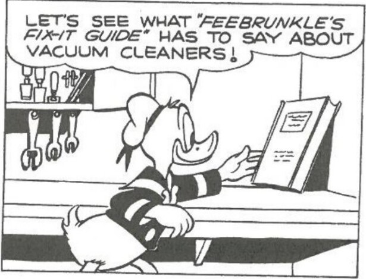
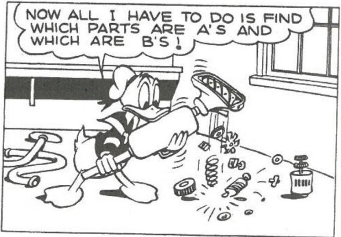
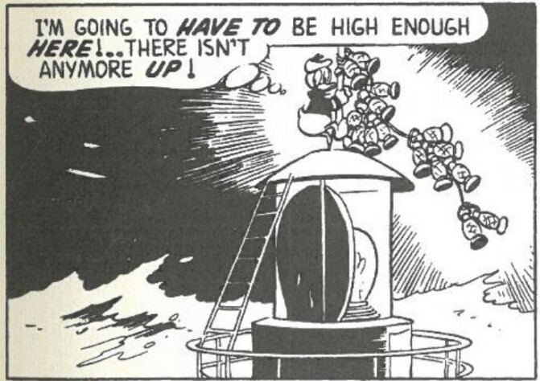
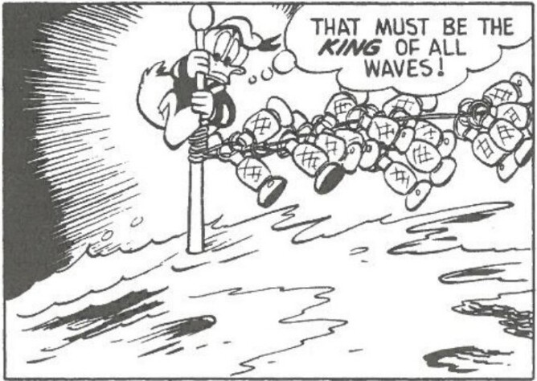
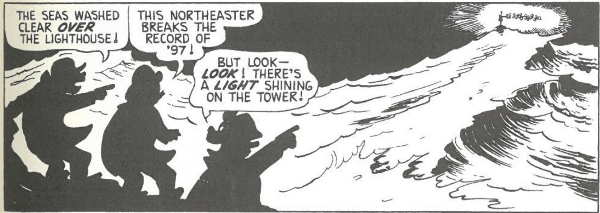

Each panel in "Feebrunkle's Fix-it Guide" speaks volumes about Donald's character in this story (Barks varied Donald's character from story to story), and what Barks leaves out between the panels is as important as the precise gestures and words he uses to construct a continuity that works as a relay to move his readers through the jumps in time between the panels.

In "Northeaster on Cape Quack," the cinematic quality of Barks's layouts praised so highly by George Lucas is strikingly evident.17 The sudden pulling back of the imaginary "camera" to take in the panorama suddenly and dramatically situates Donald holding the lanterns (in mid-range "shots") in the first two panels as the source of a distant, lifesaving light. In this sequence Donald is being heroic almost beyond belief—literally risking his life—while still retaining his sense of humor.

Paradoxically, the very techniques Barks used to make himself disappear as the author of merely fictional stories—analogous to the so-called "transparency" effects of classical Hollywood cinema that seem to make the camera disappear—drew him into public visibility. One could say that Barks was the first comic book artist to be "unmasked" because his was

***

<page_header>
INTRODUCTION xxvii
</page_header>

xxvii

the most powerful anonymous imagination in comic books—he was the only one continuously producing both story and art month after month, year after year.

Perhaps because Beaumont's essay in *Fortnight* revealing Barks's identity and unique role at Western Publishing did not receive wide distribution (copies of it are officially housed today only in California libraries), it did not attract the attention of Barks's potential fan audience. At least it did not come to the attention of Malcolm Willits, who was in college at the University of Washington in 1955, where *Fortnight* was apparently not distributed. It was not until two years later that Willits decided to write to the Disney Studios to try to learn the identity of the Donald Duck-Uncle Scrooge artist-writer, indicating this time that he wanted to interview Barks for publication in a fanzine he had been producing entitled *Destiny*. In the response he received from Frank Reilly in the Disney comic strip department dated 6 November 1957, Willits became the first real "fan" ever to learn Barks's name and address. Because Willits was in the army at the time, stationed in Minneapolis, two and a half years passed before he told John Spicer, the only other Barks fan Willits had ever met, who