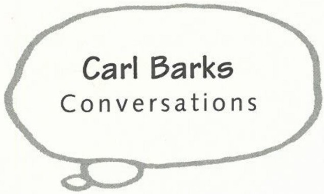

**1998**: Leonardo Gori and Francesco Stajano conduct an interview with Barks in Grants Pass for their book *Il grande Floyd Gottfredson*.

**1999**: Ault, Hamilton, Nicky Wright, and John Ronan conduct the last extensive interviews with Barks (28–30 Apr.) in Grants Pass; Barks is diagnosed with chronic lymphocytic leukemia and begins chemotherapy treatment (July).

**2000**: *Disney Legends* documentary on Carl Barks appears on the Disney Channel; Barks requests that all life-prolonging medication (including chemotherapy) be stopped (June); Ault pays his last visit to Barks (16–20 June); on 25 Aug., Carl Barks dies peacefully at home in his sleep at 12:15 A.M. PDT.

***

