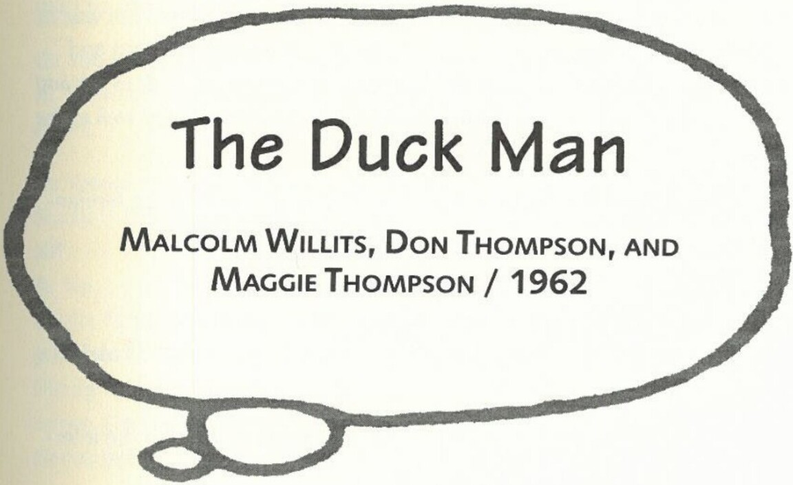

# The Duck Man

**MALCOLM WILLITS, DON THOMPSON, AND MAGGIE THOMPSON / 1962**

From *Comic Art* #7, 1968. Reprinted in *The Duckburg Times*, No. 10/11. 27 March 1981.

*The original interview for this article was conducted in December 1962 in San Jacinto, California, by Malcolm Willits. In 1968 the printed version was transcribed by Maggie Thompson and heavily edited and expanded by Don Thompson. Reprinted by permission of Malcolm Willits and Maggie Thompson.*

**Q:** Could you give us who's who type data? Birth, schooling, marriage, children, grandchildren, etc.?

**A:** I was born March 27, 1901, in the homestead cabin of my parents near Merrill in southern Oregon. Education: 8th grade in one-room schoolhouse (like what the educational system should go back to!). Married three times. Two daughters by first wife. One daughter still living. Four grandchildren. Three great-grandchildren.