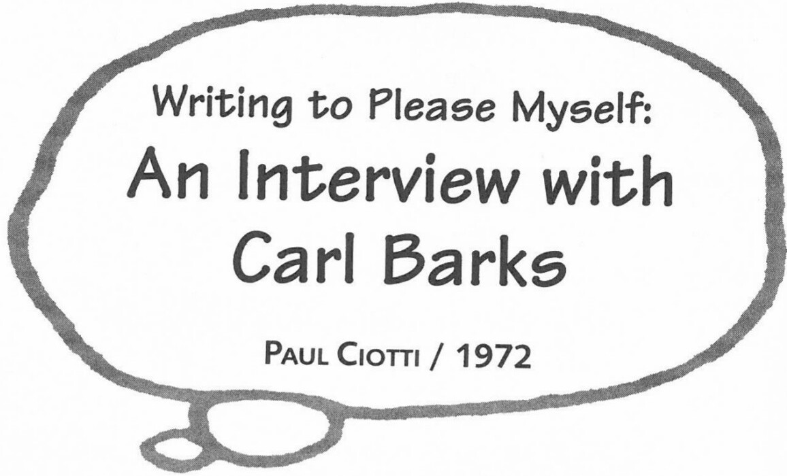

Unpublished interview conducted on 28 September 1972 in Goleta, California. Transcribed from the original audiotape and printed by permission of Paul Ciotti.

**PC**: Do you have any idea of how many people have read your stories over the years?

**CB**: The top sales figure by *Walt Disney Comics* was up around 3 million, and at the same time *Uncle Scrooge* would be selling about 3 million.

They would be the same readers, of course, but suppose the sales were 3 million, you'd say that at least twice that many people read the magazine, because a lot of the magazines just circulated on and on.

So I would say there was a steady readership of about 6 million in the early 1950s. Later, as magazines kept cutting down on the number of their pages, and also the television began cutting in on circulation, all the figures kept dropping down. Now I guess it would be stretching it to say there are 500,000 readers.

***

**PC**: In reading some of your fan mail, I did see a note from the *L.A. Times*, and they said that the worldwide annual circulation of all the Walt Disney Comics is 250 million per year.

**CB**: Yes, well that would be all right on a worldwide basis. A lot of that is the reprints, of course. I don't know how many millions of people have read the "classics," the *Uncle Scrooge* #1, some of the *Walt Disney Comics* back in what they called the Golden Years. It would be many, many millions who read those, some of them two or three times. That's what flatters me is the people who read the stories a second or third time.

**PC**: I remember some people saying in your fan mail that they've read some comics fifty times or a hundred times, or they have the complete comic memorized, all the dialog.

**CB**: I don't doubt it, because they come here and they amaze me. They can tell what happened in a certain panel on a certain page in a certain issue, and I couldn't even remember what was in the issue! Yeah, they know the number of the magazine, what was on the cover and all the way through it. It's like a piece of poetry as if they memorized it.

**PC**: I think it's like baseball batting averages—kids know them just like that. But one of the things that always impressed me is that when I talk with someone who is my age (28, 30, 32), and tell them that I'm doing a story on Scrooge McDuck—now, they're the kind of people who read comics when they were 12 or 13 or 15, and they've gone to college and never thought about it since then—but as soon as I mention Scrooge McDuck, instantly they say, "Oh, do you remember that story about the Andes? the Golden Helmet? Bear Mountain?" And if you show them the comic book they can remember whole pictures and the scenes and stories after twenty years, after never thinking about it, after never looking at it. There's something about the work that makes a tremendous visual impression that carries all these years.

**CB**: Well, I hope so, I hope there was something in there that will live on and on. People read *Treasure Island* and those stories; they are great classics. I hope some of my stories could be classics, too, at least some of my stories, to be remembered and read over and over in school libraries and such places. . . . The real surge in comic books came during the late 1930s and the next twenty years after that. And they certainly did leave a mark on literature, they certainly were a new form of literature, and they certainly did leave a mark on the whole darn world, you might say. Every kid