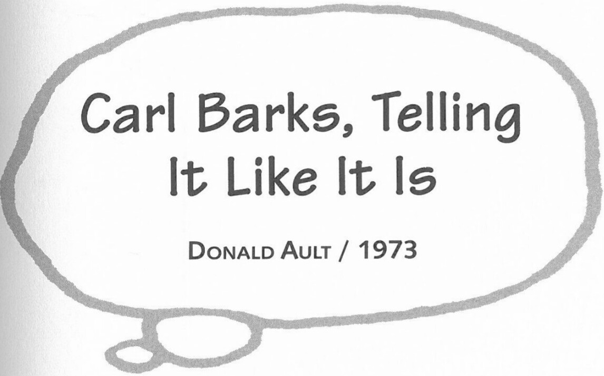

school for two years, in Santa Rosa, in the fifth grade. But anyway, there was a lot of California culture hooked on to us kids, even in those years. I think that's when I first began reading about it. I'd always had a desire to go along that old El Camino Real and just follow it from one mission to another and maybe make photographs and drawings of it. I've always been fascinated by California history. I'm a little bit interested in the history of the east coast too, but not a great deal. I probably would've been if I had been born and lived back there. I was right here, you know, where California scenes took place.

**PC:** I always assumed that Donald Duck came from Ohio, and I just thought it was a little more midwest than Pennsylvania, where I come from.

**CB:** Yeah, the town of Duckburg was a real strange place. It was on an ocean, it was on a lake, and it was out in the plains and close to tremendous mountains and a black forest and all of that. It had snow in the winter, terrific snows, and all these palm trees and so on. It was really a strange place. It's always very close to the desert. You remember, he would leave Duckburg and go right out into the Mojave Desert, just a short ride.

**PC:** Then he might be in the mountains of Yellowstone.

**CB:** Yeah, very close by. He was living in a very unique community. Anyway, I don't come up with very lucid answers to things just offhand, not being used to interviews. Questions catch me off-balance and I'm liable to say anything, and then regret it afterwards.

**PC:** I'm sure that happens to anybody who's not asked questions continually. They don't have these sophisticated replies that you see politicians are able to give.

**CB:** They get their built-in reflexes, and they have a knowledge of what is usable, and what not.

**PC:** In one of your letters in answer to a guy who wrote a fan letter, you said that you hoped that more people who read your stories as a child ended up in the Senate chamber than the gas chamber. You said that as far as you knew, so far, you'd heard from guys that were engineers, and stuff like that, but you hadn't heard from anyone who was in jail yet.

**CB:** Yeah, that's right.

***

Unpublished interview conducted on 29 May 1973 in Goleta, California. Transcribed from the original audiotape and printed by permission of Donald Ault.

**DA:** A long time ago you mentioned "Modern Inventions"—remember, the first time I was here [in August 1970]—that had this gag with the barber chair?

**CB:** That was an old movie short.

**DA:** That was the gag that moved you out of the in-between department into the story department?

**CB:** Yeah, that's right. I had sold a few gags before that, but that was the main gag that caused Walt to think I might have story-man possibilities. Anyway, he paid me fifty dollars for the gag, which was a fantastic sum of money for anything around Disney's or anything that I had ever been paid for before.