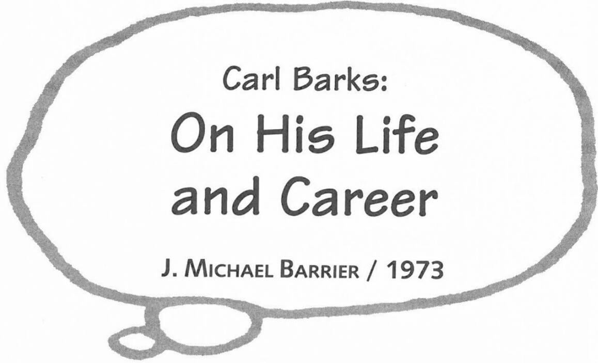

Unpublished interview conducted on 22 November 1973 in Goleta, California. Portions of this interview appeared in altered form in J. Michael Barrier's *Carl Barks and the Art of the Comic Book*. Reprinted by permission of J. Michael Barrier.

**BARRIER:** You started as an in-betweener, didn't you? That was your first job at the Disney studio?

**BARKS:** That was the first thing they put me on, and I wasn't making out too well at it. I began turning in scripts, or gags for the comic strip, and I was attracting a little attention that way. I was beginning to turn in some pretty good gags, and finally I turned in the gag of the barber chair that was made into a movie called "Modern Inventions." Walt paid me fifty dollars for the gag. He seemed to get the idea that I should be working in the story department rather than over in animation.

**BARRIER:** So it was Walt's personal decision to put you in the story department.

**BARKS:** Well, yes, he was basically back of it.

**BARRIER:** It seems remarkable that he would be that much in control of the whole studio, that he would reach down and put an in-betweener in the story department.

**BARKS:** He was a man who had his fingers on just about everything around there. They say he used to prowl around the studio at night, all by himself, even when the janitors had gone home, and look in the guys' desks and look through their papers to see if they had been thinking up any little private ideas on their own.

**BARRIER:** When you went into the story department, did they put you in with some other people right away?

**BARKS:** Oh, yeah, that's right. The first thing that happened to me from animation was to go over to work with Jack King, who was a director. Jack had just been brought back to the studio from Schlesinger's at that point and told to make that "Modern Inventions" into a duck movie. So for about two months, I was working with Jack King. When that went into animation, I was put in a little room and told to think up another story. I wasn't getting very far very fast, so one of the guys in the department said, "Barks is just wasting his time here, he'd better be put with somebody like Harry Reeves, who has had a lot of story experience, and then his wild thoughts will be directed more along usable lines." We worked as a team for a number of years. I worked on thirty-six [duck cartoons], and I would say about eighteen of those I worked with Harry Reeves. There was a whole swarm of them from 1936 through 1942, and I had a finger in all of them.

**BARRIER:** What were your impressions of Walt? Did you only see him when he came in for the dissection of the story?

**BARKS:** I had a great respect for him. His ideas were always good; his analysis of things was always so darned keen. He had a tremendous intellect, as far as that kind of stuff went. He could look at a gag, and like Chaplin, he could tell whether a gag was funny or not just by—he could see it moving in his mind. Now, that's one of the things that handicapped me. I don't think I visualized stuff in action like I should have. I was more of a plot man. I could work out the plots, the timing on gags, but all the individual action that was to depict that gag on the screen was something that was a little over my head. I didn't see it. Walt, I think, could see it [with] music, whether it was on eight-beat, or four-beat, or whatever. He could hear the music, as he was looking at that storyboard. Now, these guys—Harry Reeves, for instance—he would see everything in action, he