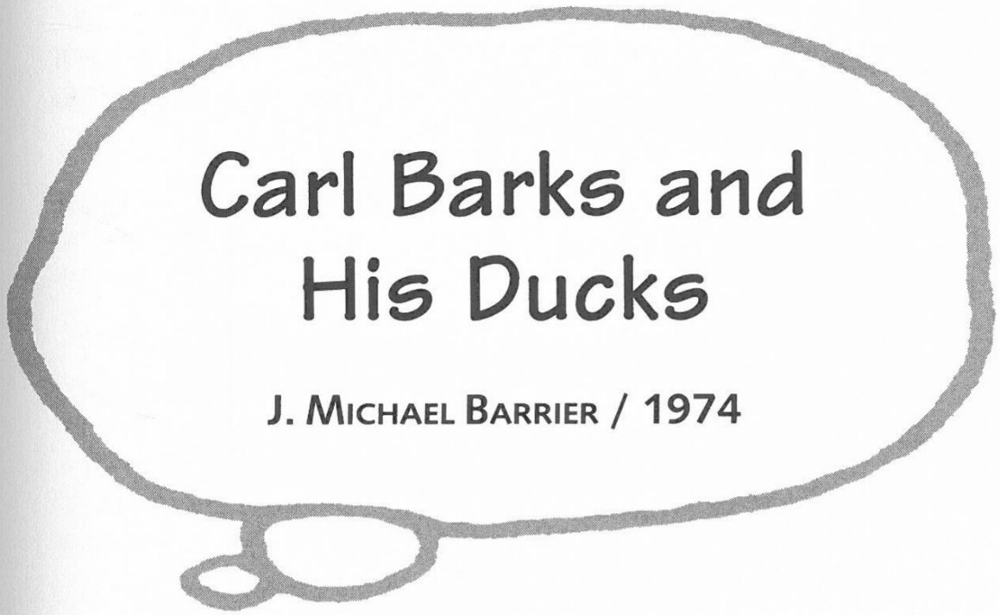

use of going on like this; we might as well get married and pool the money all in one bundle.

**BARRIER:** How did you two meet originally?

**BARKS:** She came over to see me at a time when my second wife and I were in San Jacinto. I was drawing the comic books and a little article had been printed about me in the newspaper down there, about how I was working on duck comic strips, and I guess Garé had heard about it, and she thought maybe I might have some work that she could do to help out. She came over and talked and asked about it. I thought it all over, and I thought, well, do I want to take on the responsibility of an assistant, and how much work could I provide for this girl if I did? And so I handed her a bunch of duck model sheets and told her to practice on those and see what she could do in the way of inking and so on. She tried it out and let me know that she found it much too difficult. So it was years later that I persuaded her to try out on the lettering. She had been working at an aircraft office during the war, doing drafting of these big bombers and so on, so she had gotten to have a wonderful lettering style.

***

Interview conducted on 5 October 1974 and 6 October 1974 in Atlanta, Georgia. Portions of this interview appeared in altered form in J. Michael Barrier's *Carl Barks and the Art of the Comic Book*. Reprinted by permission of J. Michael Barrier.

**BARRIER:** As far as Walt was concerned, were the story conferences really that important? Did he need them?

**BARKS:** No, he liked to have the group in there—the director and two or three other gag men. Walt might interrupt [the story director as he was telling the story] and say, "Well, wouldn't that gag have been better a little earlier?" or "Wouldn't it be better to put that a little later?" When he first sat down in the chair and looked up at that storyboard, he could grasp that story in about two minutes, before the conference ever started. He knew what that whole story was about. And so when the guy got to talking it over and pointing out what each little sketch meant, Walt already had an idea formed. He would make his suggestions and look around at the other guys, see how many were nodding their heads.