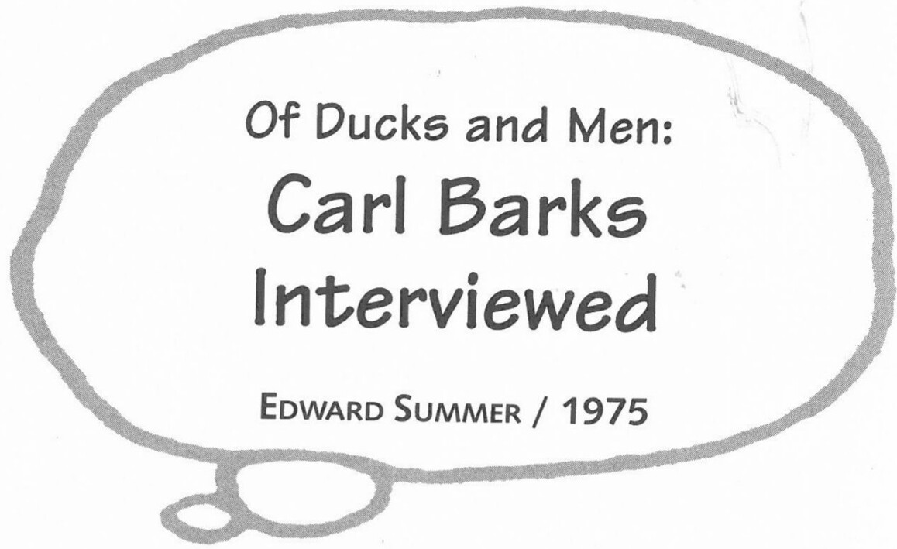

Previously published in a slightly altered version in *Panels* #2, Spring 1981: 3-10. Reprinted by permission of Edward Summer.

This interview was recorded in April 1975 in connection with a film series by Edward Summer entitled *The Men Who Made the Comics*, a project supported by a grant from the National Endowment for the Arts, a Federal Agency in Washington, D.C. Other films in the series include those on Milton Caniff and Jack Kirby, portions of which have been seen on CBS's *Camera Three*. Summer is currently working on a feature film titled *Teefr*. The recording engineer for this interview was Sam Grossman. The transcript for the *Panels* version was edited and prepared for publication by John Benson.

**CB:** How I came to be a cartoonist is as much a mystery to me as it would be to anybody else. I have no cartoonists in my ancestral tree whatsoever, no artists that I know of, no writers that I know of—I was just a sort of a

***

mutant that came along and I was born up in eastern Oregon on a little homestead. My parents had no cultural background, no education much, and I got through the eighth grade in a little one-room schoolhouse, no art training whatever, but I did have a desire to be a cartoonist. And I would draw pictures with charcoal on the walls of any kind of a building I happened to be in, and I would scrawl all over my schoolbooks and we had slates in those days. Imagine that—slates, those squeaky things. And I would draw on those slates and any kind of paper I could find.

By the time I was 16, I had become pretty well assured that I wanted to be an artist or cartoonist more than I wanted to be a farmer. But I lacked the opportunities to meet with people with the same sort of ideas, and I had to go out and be a cowhand and a farmer, a muleskinner, lumberjack, anything that happened to come along that would furnish me with a living. I'd worked in a printing shop, been a cowboy and a whole bunch of other things, with practically no success whatever—I was a failure at all of those enterprises. In 1928 I was working at riveting, not as a riveter, but as a rivet heater on a riveting gang in railroad car shops, when I decided I could sell cartoons to the comic books. Not comic books, but comic magazines, like *Whiz-Bang* and those old joke magazines. And so I drew a few cartoons. Surprisingly, they sold, and I discovered that I had to write jokes to fit the cartoons so I could sell more cartoons, and that way I got to writing one-line gags and illustrating them and selling them and even sold a couple to *Judge*, which was the real good joke magazine in those days. And I even think I had one published in *College Humor*. I can't recall for sure now. I was doing that, and then I got a chance to go on the staff of *Calgary Eye-Opener* back in Minneapolis. I went there and worked four years.

But the wages were getting smaller by the hour, and I read in the paper that Walt Disney's was looking for cartoonists, and I had been making a living as a cartoonist, so I drew up a few samples and sent them out there. This was along about October of 1935. And I quite soon got an answer back from George Drake, who was the hiring guy there at Disney's, and he suggested that I come and try out. Twenty dollars a week. So I did it. I quit my job at the *Eye-Opener*, and I went out there on a wild gamble that I could make it. I started working with the in-betweeners. I think that the first in-betweens I did were on the shorts.

**Q:** Was there a particular animator that you worked with?

**CB:** No. The in-betweeners who were in training, they just took whatever