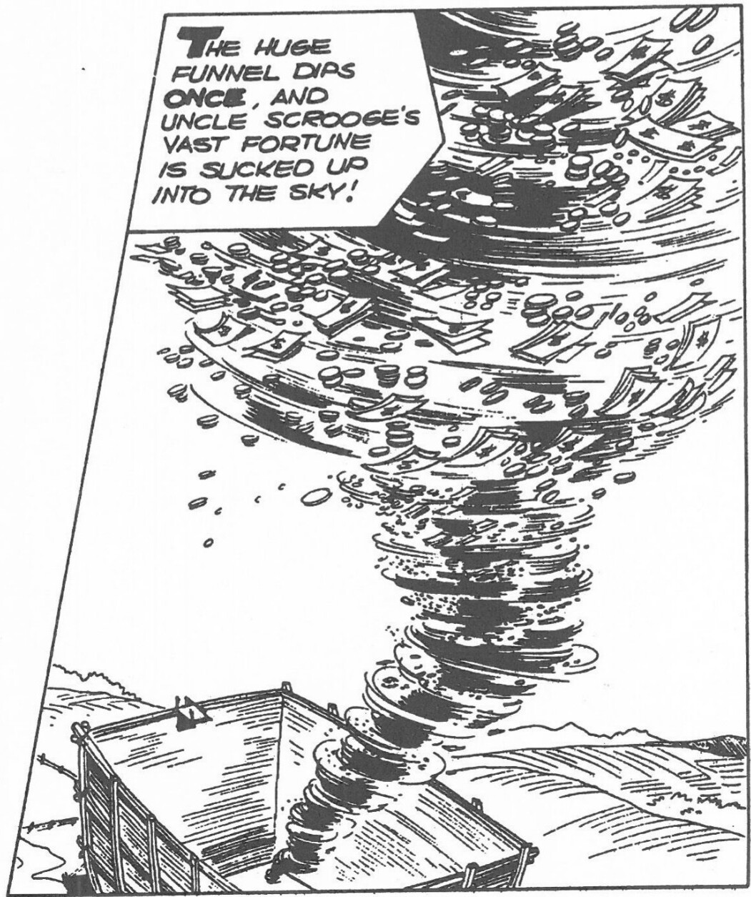

Their hats have to react—they fly off of their heads. Their coattails have to fly back in the air. In other words, every part of the ducks and their clothing has to show some bit of the action. It has to flow with the action. And their eagerness as they think they're going to land in a big lake full of water must show, too, in their expressions.

**Q: Do you ever skip the preliminary process and just go direct without drawing the circles?**

**CB:** Not very much. It's very much better to draw the circles, because then you get the construction, the basic construction of the guy—like the skeleton, in other words. In the next stage their expressions have to be refined, which is done mostly with patient redrawing and erasing. When I'm drawing the faces I think about what their basic emotion is, what they are doing there. These little guys are really happy, they think they have seen a lake of water out in this desert, so I try to show that emotion in their faces and in their poses, their eagerness as they look out across the sand and think they see this lake. They really lean into it. Even their fingers have to express a certain amount of emotion.

In drawing the duck's faces, I used to act out the expressions on my own face, all unconsciously. If I had the ducks angry, I would strain myself to draw their anger and get the feeling so much that I was grimacing, and if I had them scared, which they were so much of the time, or popeyed, I would draw that with my eyes wide open and practically imitating the ducks' expressions, except that I didn't have a beak. And the result was that I would end up with a headache, because when you look at those ducks they have big round eyes, and somehow I was trying to imitate that, and my physical eyelids just couldn't make it. And my jaws would get so tired from going up and down like that all day long grimacing, making frowns, my forehead would be all kinked up. I would really be tired when the day's work was done. Oh, it was work.

**Q: When you were doing the dialogue, how did you work the words out to fit in the panels?**

**CB:** I tried to make it as brief as possible. If I could find a word that would express what four words say, I would use that one word. So I had a sort of short, very crisp dialogue in my stories as a result of that contracting them down. And, in order to get dialogue as short as possible, sometimes it was necessary to even count the syllables, and I would do that if it got down to it, and that also helped to create an even flow, so that it was almost like prose poetry the way the ducks voices would come in.

***

<page_header>
EDWARD SUMMER / 1975 87
</page_header>

**Q: What are some of the other stories [besides the square egg story] that you're particularly fond of?**

**CB:** Well, I liked "Land of the Totem Poles," and also the forest fire story in the 1950 25¢ Vacation annual. And the first issue of Uncle Scrooge. Of the ten-pagers in Comics and Stories, I think the March 1951 story about the cyclone distributing Uncle Scrooge's wealth is the best. I also liked the story about Uncle Scrooge's search for the horseradish down under the sea in the sunken ship. That gave me a chance to show his character where he was up against a situation where he could dissolve all of his troubles by just leaving a guy to drown out there in the ocean, but he perpetuated his troubles by rescuing the guy and saving his life. It gave me a chance, too, to show that villains don't reform just because you do

> THE HUGE FUNNEL DIPS ONCE, AND UNCLE SCROOGE'S VAST FORTUNE IS SUCKED UP INTO THE SKY!