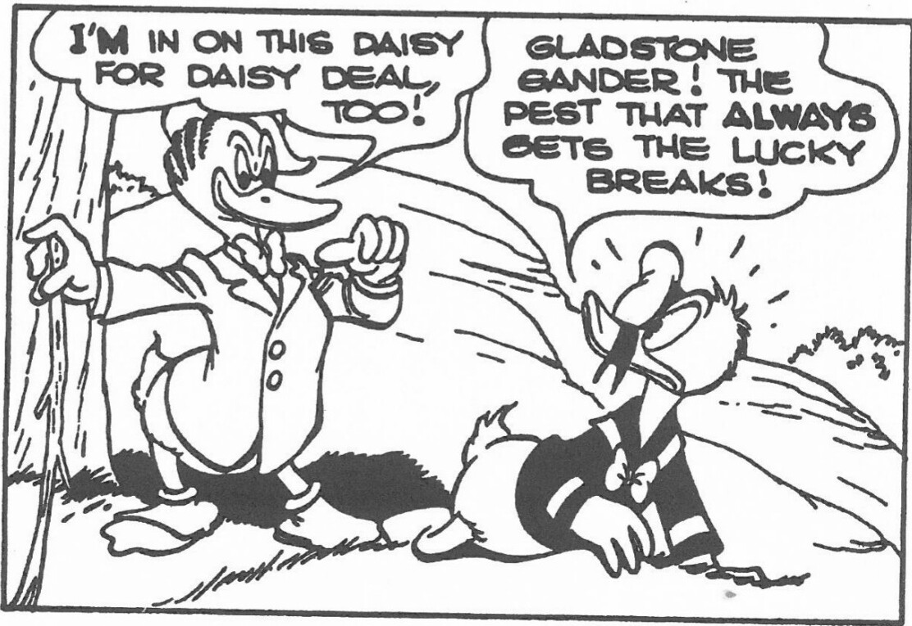

Bear Club up in San Francisco that go out the Golden Gate and swim around on New Year's Day. And I just thought of Donald: how in the summertime he would get very rash and boast that he would go into the water in the wintertime. And so that's how Gladstone got into it. He had to be somebody that Donald was trying to outdo.

**Q: How did you come up with the name?**

**BARKS:** Well, Gander . . . and Gladstone . . . it's a phonetic thing. Donald Duck is phonetic, you know: you wouldn't say Frank Duck.

**Q: And the idea to give Gladstone his incredible luck?**

**BARKS:** Well that came the second time I was using him. I established him as an obnoxious character in the first story, and so the second time I used him I thought, what particular thing can make that guy lastingly obnoxious? So I thought of this lucky angle. He was the kind of a guy who got all the breaks, and poor old Donald never got anywhere.

**Q: What about Scrooge?**

**BARKS:** The office wanted me to do a Christmas story, and casting around for Christmas stories, I began to think of the great Dickens Christmas story about Scrooge. Somehow it is the classic of all Christmas stories. Now I just was just thief enough to steal some of the idea and have a rich uncle for Donald. I guess the fact that he was rich was the thing that triggered

***

<page_header>
AULT, ANDRAE, AND GONG / 1975 95
</page_header>

all further developments—as to just how rich and the showing of his wealth. I found that that was quite a fascinating subject—just piles of money would appeal to a lot of people. And I just gradually made him richer and richer, and then I had to develop a place where he could store the money, and all the time there were the Beagle Boys trying to steal it from him. Those things just grew like building brick walls: you just lay one brick on top of another, and finally you've got a whole thing built.

**Q: Didn't some characters like the Gneezles come in a flash of inspiration?**
**BARKS:** Well, that was a story that did come as a sort of a flash. I had been struggling for days trying to think of something that I could use for a long story plot. And there was a whole bunch of company in the house at the time, and I never had time to really sit down and think of anything. Finally I got to the point where I just ignored the company, and I sat by myself out on the lawn in the swing and did some serious thinking. And all of a sudden I got to thinking of the everglades . . . and what could Donald do in the everglades . . . and what sort of creatures besides alligators would he find out in the everglades? And just like that, I thought of all these weird little people, like little gnomies who lived in there. As soon as I thought of them, why, ideas of how to use them just kept poppin' into my head; so I just sat there and let the thoughts pour all over me, and I remembered as many as I could. When I had gotten enough that I knew I had a story, I joined the party and hoisted a few drinks. Next day I was hard at it, writing the Gneezle story.

**Q: Did you often build a story around the idea of a locale?**
**BARKS:** The locale started me on more stories than anything else. Like I say about the Gneezles, I just thought of the everglades. Often while struggling for a story I would think, What locale do I want to draw? Do I want to draw a forest? The sea with sailboats? Or would it be down in the mines and caves? Soon as I had thought of a locale I would enjoy drawing, it seemed that I could much easier think of a reason for putting those characters in that locale. What would they be doing there? All of those things you just build backward from the big climactic situation, and pretty soon you've got the steps of a story.

**Q: What about the creation of imaginary locales?**
**BARKS:** When you've got a mysterious place, then you develop something out of whole cloth. It's a mysterious place down under the earth. We don't know what's under the crust. Scientists tell us it's a big molten