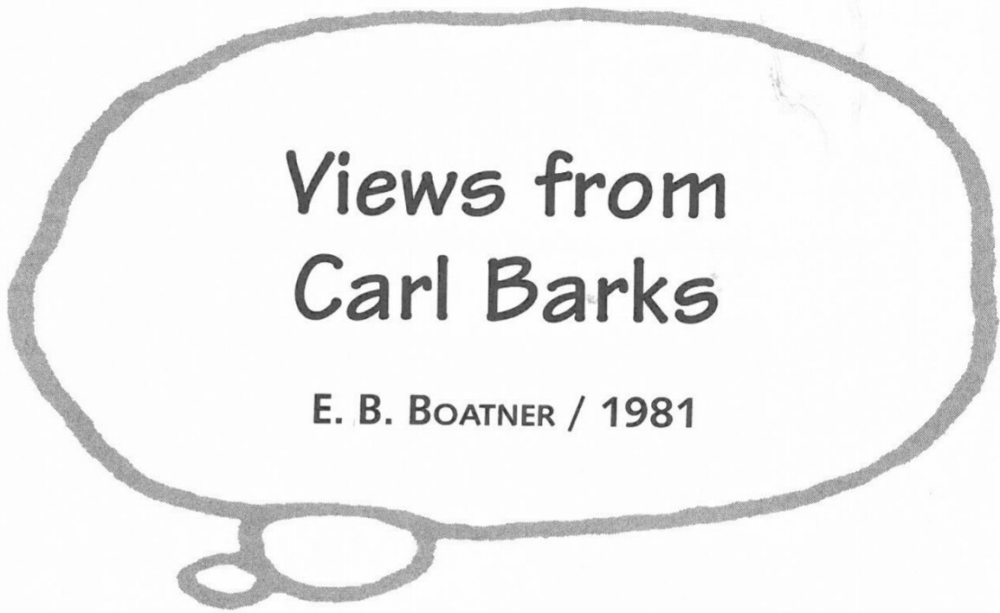

Excerpts from the Introduction to *The Fine Art of Walt Disney's Donald Duck* by Carl Barks. Scottsdale, AZ & West Plains, Mo: Another Rainbow Publishing: 1981. 29-30, 35-36, 38-39, 40. Reprinted by permission of E. B. Boatner, Bruce Hamilton, and Another Rainbow Publishing, Inc.

## On Walt Disney

Disney liked to feel that everyone was an extension of his own intellect. He was a sort of dreamer who came up with these quick and brilliant ideas and who had the aggressiveness to carry them out. Some of the things he did looked so stupid at first sight that I guess people got the idea he wasn't very damned intelligent for even thinking of such kooky ideas. Like Disneyland. Now, I swore the guy was nuts there, but he was nearly always right. His general batting average was well up there, about .750.

I felt that it was Disney's genius and aggressiveness that provided jobs for guys like me, the mice men of the world. Of course, I was a duck man, not a mouse man, but I was a mouse by personality. I didn't have the

***

aggressiveness to ever produce a strip of my own. Disney gave me a stage on which to perform my little vaudeville act, and I did all right with it. I would never have had that opportunity in any other circumstances; he gave me that break, and a great many other artists too, who would have been waiters and truck drivers and trash picker-uppers. Disney's aggressiveness, and the fact that he was such a genius and an unbelievable optimist got all those jobs for thousands of artists. He wasn't living like Norton Simon and some of those other millionaires—he was a millionaire for just a few moments until he could find some place to dump it all and get into debt again. I don't think the guy was ever comfortable unless he had the bankers pounding on his door.

## On His Own Solitariness:

Isolation? It was an isolation that I chose. I preferred it that way. I was never interested in people around me much, or in myself—was never way out there trying to change the whole structure of the universe. I guess that's why when I did write those duck stories I could get completely lost, lose all contact with where I was and just go ahead and write those things and really live them. Some people don't have that ability to create their own work which they can depart into.

## Duck Philosophy

I think one of the duck's philosophies, as near as I could ever figure it out, was that nothing was ever so damned important that you should worry about it a hell of a lot.

## On the Desire for Travel and Wealth

I don't think I ever had any great desire to travel. . . . No, I can't recall ever having any great desire. I guess it was that I satisfied myself in my imagination. I didn't ever feel I wanted to travel a lot, or that I wanted to be rich or anything. Just so long as I was comfortable, I was all right. That's how I could find so much fun with old Uncle Scrooge. He was just a fictional character that loved all that kind of stuff. It wouldn't have appealed to me at all.