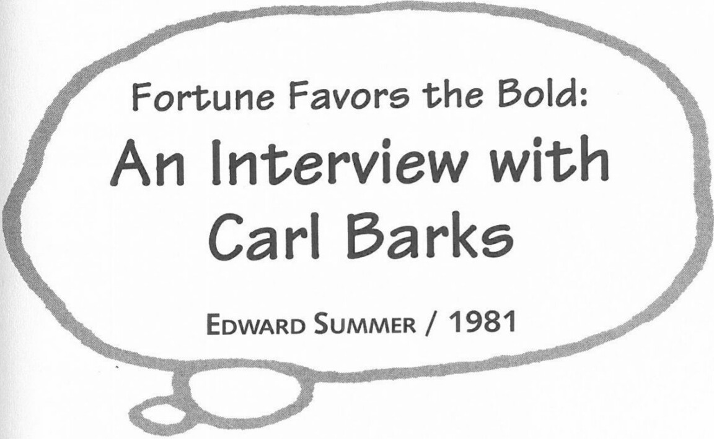

## Flashes of Inspiration

I woke up one night thinking, "Petroglyphica!" She was the first secretary. She chiseled words in stone as her boss dictated. He was not a fast talker and that was how she was able to chisel whatever he was saying on those big stone tablets. The name stuck, and when I got out of bed the next morning, I could still remember it. I don't know, these crazy names just come to me in the night.

## On Losing His Disney Oil Painting License in 1976

I would prefer that fans accept it with good grace. Disney's move was made from necessity, not from stinginess. It was done with much reluctance. I would prefer that fans realize these things. Let them consider the scope of that original permission Disney gave me. Try to think of any one time that General Motors gave an ex-employee permission to make Chevrolets!

***

From *Uncle Scrooge McDuck: His Life & Times*. Ed by Edward Summer. Millbrae, CA: Celestial Arts, 1981. 89-91, 117-18, 175-76, 216, 239-40, 292. Reprinted by permission of Edward Summer.

*This interview material was recorded between 1975 and 1981, in connection with a film series by Edward Summer entitled The Men Who Made the Comics, a project supported by a grant from the National Endowment for the Arts, a Federal Agency in Washington, D.C.*

I liked stories that gave me a chance to draw water and ships sailing into storms and big pictorial panels. It helped take the monotony away from drawing just round-headed ducks all the time. I'd look at pictures of boats or whatever when I was working. While I never copied the layout of any boat, I would always develop one that was so simple I could use it from one scene to another. The reader could always refer to a long-shot view and check it against the close-ups and see where the characters were in relationship to some spot on the boat. In [*Uncle Scrooge* #3], there's a