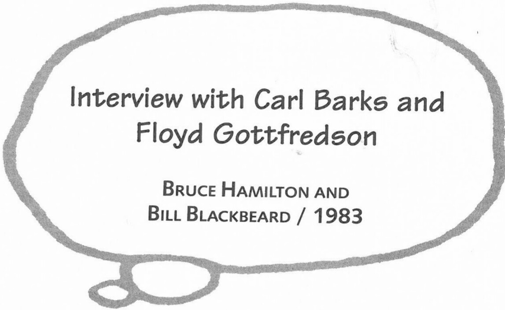

# Interview with Carl Barks and Floyd Gottfredson

**BRUCE HAMILTON AND**
**BILL BLACKBEARD / 1983**

From *Mickey Mouse in Color*. Prescott, AZ: Another Rainbow Publishing: 1988. Reprinted by permission of Bruce Hamilton and Another Rainbow Publishing, Inc.

The first portion of this interview was conducted by Bruce Hamilton and Bill Blackbeard on 6 December 1982 at the apartment of Floyd Gottfredson in North Hollywood, California. Also present at the interview were Garé Barks, Mattie Gottfredson, Helen Hamilton, Leonard (John) Clark, and Russ Cochran. The second portion of this interview with Barks and Gottfredson was conducted by Bruce Hamilton in a motel in Burbank, California, in the spring of 1983.

**BH:** Carl, you and Floyd are both perfectionists. What comic strips influenced you in this respect, and what ones did you like during your formative years?

**CB:** It was the *Mickey Mouse* strip that he did that influenced my drawing more than anything else.

***

**FG:** (laughing) That's amazing!

**CB:** Other artists were . . . [*Wash Tubbs* and] *Buzz Sawyer*—that was Roy Crane, [Hal Foster's] *Prince Valiant*, [E. C. Segar's] *Popeye* . . . a whole bunch of them. They contributed small things to my drawing style. But it was all to help me adapt myself to Floyd's way of drawing. Especially in the inking.

**FG:** That's amazing, and I'm very flattered.

**CB:** Well, look at my ducks and all those other characters. I've been trying to imitate Floyd's work. It's plain to me, and I hope it's plain to other people.

**BH:** Which strips influenced you, and how? Was it the humor or the style of writing?

**CB:** As for humor and the story side of it, that was, I would say, *Popeye* and *Barney Google* and a whole bunch of newspaper strips from years ago. While I didn't ever do that type of humor very much, at least they planted seeds in my head, so that I formed plots and I saw gags in ways that had been implanted into me subconsciously from these guys' works. And also, in [Floyd's] strips, the way you would build up to a climax. It always helped my story techniques.

**BH:** Let's go back in time [for your opinions of comics artists]. One comic writer fans consider an unbridled genius was E. C. Segar. What do you two think?

**CB:** I agree, he was the unbridled genius as far as I was concerned.

**BH:** There isn't much you can say beyond that, is there?

**FG:** There isn't, because you've said it all already.

**BH:** A couple of other names come to mind because of the conversation we have had. You mentioned *Tarzan* earlier and Foster's contribution. What do you think of the entirely different style of Burne Hogarth's *Tarzan*?

**CB:** I loved Hogarth's stuff. There, too, was a style of drawing that had quite a bit of Disney in it.

**FG:** Yeah, very strong.

**CB:** Yes. The accented curves!

**FG:** Again, he didn't come up anywhere near Foster, but probably second to him.

**CB:** Hogarth's stuff was too anatomical. It didn't have the soul. The soul didn't show through the anatomy.