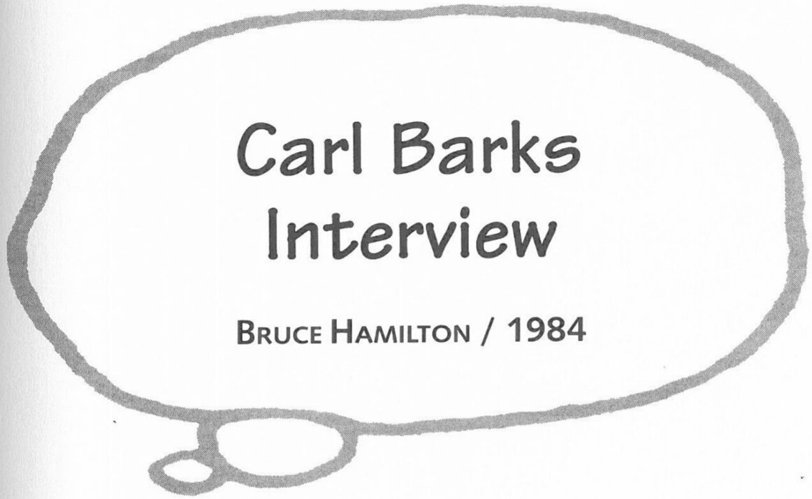

**BH**: But you'd still try to have little mini-cliffhangers at the end of each page.

**CB**: Yes, of course. It is pretty hard to do, but somehow, because of my training in the animation story department [at Disney], it did come naturally to me. I expected to give some little twist every few seconds.

**BH**: How did you feel about anthropomorphic animals talking like humans and having other animals as pets, such as Pluto or Bolivar? Did this seem to be a conflict, or did it ever make you uncomfortable?

**CB**: [Only] to the extent that I did not show Donald having ducks in his backyard or shooting ducks or anything in which a real live natural duck would be in the same story with him. But as for dogs or wolves or lions or any other animals, he could handle them the same as a human would.
**FG**: We just never gave any thought to it.

**BH**: Let's close with a question about what you think of fandom and the cult that's built up around the mouse and the duck.

**FG**: I think it's a very important thing and certainly appreciated by all the artists and writers. Very important. It's the only reaction, the only meter we've got.

**CB**: If it weren't for the fans, we wouldn't be here today being interviewed, that's for sure.

**FG**: Absolutely.

**CB**: And while I can't understand their great attraction or great attachment to these things that we've done and the valuation they have put on our work, good for them! I'm all for them.

**BH**: Gentlemen, thank you.

***

Unpublished interview conducted on 24 June 1984 in Grants Pass, Oregon. The interview was conducted by Hamilton; some questions were composed by Thomas Andrae. Reprinted by permission of Bruce Hamilton.

**Q**: Could you please explain what you were saying earlier about the Celotex boards?

**BARKS**: That is a throwback to the Disney Studio, where we worked up our stories by putting all the little story sketches in continuity up on celotex boards. When I made my [blue pencil comic book] drawings, I'd put up a page—that was eight panels—then alongside it another eight panels. I could put about eight pages on one of those big storyboards and see whether I needed to enlarge on a sequence or cut down on it. Then, when I got it all inked, I would read it again; and oftentimes I would take a whole page and throw it away. I tried to boil those stories down to where only the necessary things were in. That's why they always appeared so tight and read so quickly. I also tried to strengthen the end of each page with a little cliffhanger.