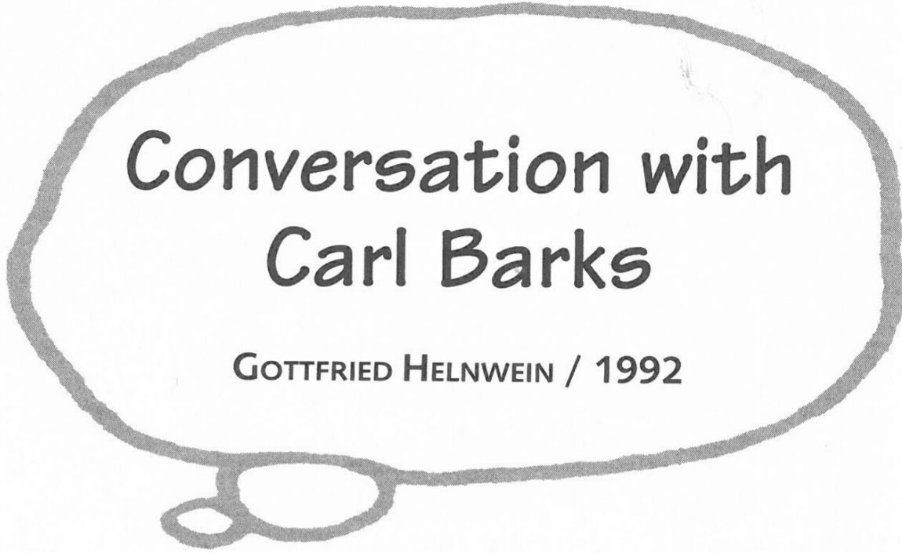

First published in an edited form as "Gespräch mit Carls Barks, 11 Juli 1992, Oregon" in *Wer ist Carl Barks*, 1992. This expanded version of the interview is printed here by permission of Gottfried Helnwein.

Originally translated from the German by Roswitha Mueller, revised by Gottfried Helnwein. The quotations from Carl Barks contained in this interview are taken from the audiotape interview as transcribed by the Helnwein Studio and are thus Barks's original words.

**H:** How would you like the idea of building an actual Duckburg one day?

**B:** Who can tell what Duckburg really looks like?

**H:** If one studies your work carefully, there are a lot of indications. The money bin, for example.

**B:** Yeah, the money bin is probably the outstanding building in Duckburg.

**H:** But I remember one in which the opening panel was a picture of the ducks up on top of a skyscraper, looking down onto a big busy city with tall, mighty buildings, a wide river and steamboats.

***

**B:** I remember, yes. But that wouldn't be the Duckburg that people should remember. It would have to be a smaller Duckburg, with Daisy and Donald's house in it and a few blocks further, Gladstone Gander's home; and naturally there would have to be Gyro Gearloose's workshop.

**H:** With all his absurd inventions, crazy machines, and robots all around...

**B:** And then up on the hill—the gigantic money bin...

**H:** And on one side we could be drilling a hole into the exterior walls like the Beagle Boys and the money would roll out. And all these traps around and in the money bin—I would construct them in such a way that they could actually function when you walk in. These old cannons, for example, that suddenly pop out of the ground.

**B:** Oh yeah, one could have a lot of fun with that money bin.

**H:** I always dreamed of diving through the money like a porpoise with Scrooge McDuck and burrowing through it like a gopher and tossing it up and letting it hit us on our heads.

**B:** In Germany they are still printing a lot of these duck stories, aren't they?

**H:** Yes, I think Germany is the greatest market for *Donald Duck* comics worldwide. You also find the most numerous and most fantastic fans there. Have you ever heard of the Donaldists?

**B:** The Donaldists?

**H:** It is an association. Or better, an order, which sees itself as the keeper of the holy grail of the eternal and pure spirit of Donald. They believe that Duckburg actually exists.

**B:** Oh, I remember. I believe I did get one of their magazines.

**H:** Do you know, by the way, that your stories were translated into German quite brilliantly by a woman named Erika Fuchs?

**B:** She must have been very good, because in my conversation with fans, I always had the impression that the German readers best understood my humor, in contrast to the Italians, for example, where the spirit of my stories apparently was lost in the translation.

**H:** The Italians?

**B:** Yeah, the Italians, they really butchered the stories.