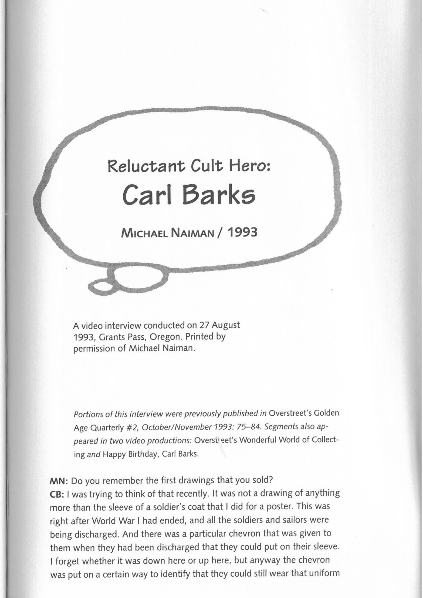

death to be out of it, because the guys—the collectors—had begun to get real darn pushy. I could make a whole dozen of them mad because I had painted a painting for somebody that they thought they should have. Somebody that they thought had gotten ahead of them on the list. And it was impossible to keep track of the list.

So that is one of the reasons why I just had to get out of the business. It had just got to be too much trouble to keep all these guys happy. And I was getting tired of painting ducks for that time anyway.

**H:** But you started again after a while?

**B:** Well, it was 1976–1982. That is six years' rest, six years of painting other things. And then another company got the license to put up lithographs, and they needed new duck paintings to go with those lithographs. That's where I started painting ducks again, for this new order. I could go ahead and paint ducks and sell the paintings. But now I reached a point where I'm used up—don't feel like I ever want to paint another duck again.

**H:** You will never paint a duck again?

**B:** I feel like I don't want to ever paint a duck again.

**H:** You must have drawn and painted millions of them.

**B:** I've painted so many of them. Yes, I've grown very tired of the subject.

***

# Reluctant Cult Hero:

# Carl Barks

## Michael Naiman / 1993

A video interview conducted on 27 August 1993, Grants Pass, Oregon. Printed by permission of Michael Naiman.

Portions of this interview were previously published in *Overstreet's Golden Age Quarterly* #2, October/November 1993: 75–84. Segments also appeared in two video productions: *Overstreet's Wonderful World of Collecting* and *Happy Birthday, Carl Barks*.

**MN:** Do you remember the first drawings that you sold?

**CB:** I was trying to think of that recently. It was not a drawing of anything more than the sleeve of a soldier's coat that I did for a poster. This was right after World War I had ended, and all the soldiers and sailors were being discharged. And there was a particular chevron that was given to them when they had been discharged that they could put on their sleeve. I forget whether it was down here or up here, but anyway the chevron was put on a certain way to identify that they could still wear that uniform