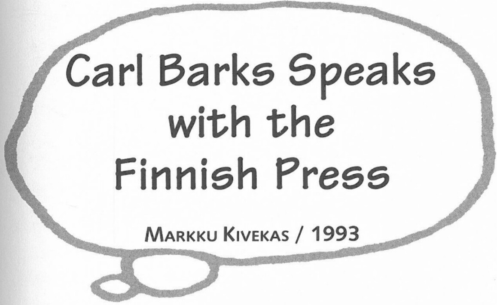

**MN:** How do you earn a Barkster award?

**CB:** Oh, I guess you have to have done something that sold a lot of comic books.

**MN:** What type of pen is that [on the Barkster figure]?

**CB:** That is a type that they dug up at the office, but I did my work with a very small penholder, and those little 356 Esterbrooks were a smaller pen than this one.

**MN:** How is Carl Barks different today than he was ten years ago?
**CB:** Oh. . . . (pause) Gotten older.

**MN:** Do you have any stories that are percolating in your mind, maybe, for the future? Or are you going to concentrate on other avenues?
**CB:** Well, I would like to concentrate on other things, but I seem to have gotten trapped into writing a story for a future *Scrooge*.

**MN:** So we have that to look forward to sometime in the future?
**CB:** If "looking forward" is the word for it, yes, it will be sometime in the future.

**MN:** This is the last question: How would you like to be remembered?
**CB:** Well, I would like to be remembered as a guy who did a good job.

**MN:** Well, I think all of your fans can certainly attest that you have done a good job. I thank you for talking with us today and appreciate your taking time out of your busy schedule.

**CB:** Well, thank you for feeling I was worth it.

***

Interview conducted on 27 September and 7 October 1993. Portions of this interview appeared in Danish *Aku Ankka* [Christmas Premium] 52B/1993. Reprinted by permission of Markku Kivekas and Sanoma Magazines, Finland.

**Q:** Tell us something about your career before Disney (*Calgary Eye-Opener*, etc.).

**Barks:** I was a common laborer with little education, always interested in drawing cartoons. Learned some of the techniques by copying famous artists' drawing styles. In the late 1920s I started submitting drawings and jokes to humor magazines. Sold enough cartoons and gags to the *Calgary Eye-Opener* to enable me to quit my laboring jobs and to eventually get hired by the magazine.

**Q:** Why did you leave the Disney Studio in the early forties?
**Barks:** I left the Disney Studios in November 1942 because I was in poor health and had to leave. I had found that the hot sunshine of the desert areas east of Los Angeles cleared up my allergies. It was a reckless gamble