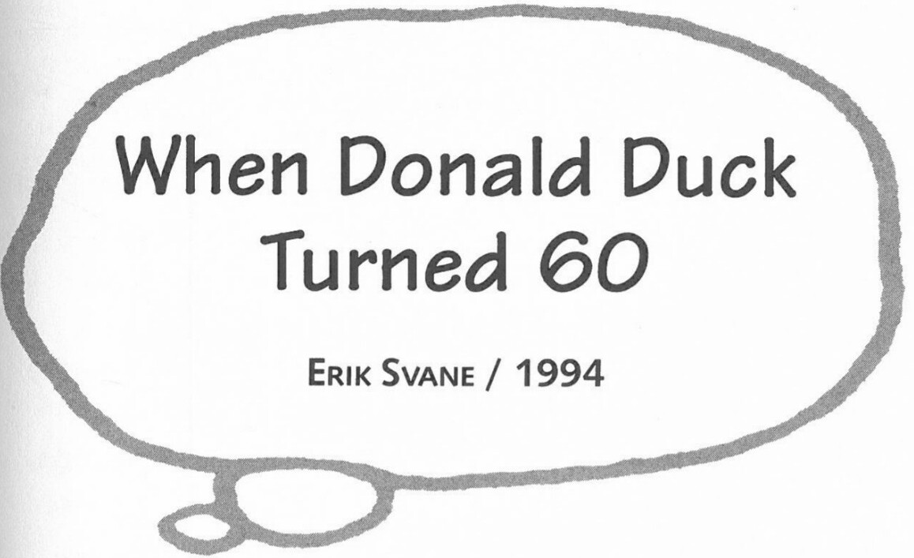

**Barks:** Uncle Scrooge is popular, I think, because he is so ridiculously rich. His money brings him no arrogance or pomposity. It is only a plaything that he hoards.

**Q:** They say artists never retire. When thinking of your activities, this is evidently true. Have you any new projects in the future?

**Barks:** My projects—if I ever do retire—will certainly include artwork in one form or another.

**Q:** Any new plans of a trip to Scandinavia or other European countries in order to celebrate Donald's 60th anniversary next year?

**Barks:** There seems to be a trip to Denmark and Norway and possibly other European countries planned next summer. I am hoping it all comes to pass.

***

This interview was conducted on 7 July 1994 and has been previously published in six different places: *Quadrado* #4, 1997 (Portugal); *SWOF* #27, 1999 (Switzerland); *BoDoï* #34, 2000 (France); *Stripschrift* #331, 2000 (Holland); *Rackham* #3, 2001 (Denmark); *Hogan's Alley* #9, 2001 (USA). Reprinted by permission of Erik Svane.

When Donald Duck turned 60, Carl Barks—who made untold numbers of people dream with his adventure stories of the Disney Ducks, although he himself had rarely left the West Coast—decided at 93 to celebrate his hero's (60th) birthday by making his first trip outside North America. He visited Oslo, Copenhagen, Helsinki, Stockholm, Warsaw, Stuttgart, Munich, Milan, Amsterdam, London, and, last but not least, Paris with its magic kingdom, Eurodisneyland, where he gave an exclusive interview to Erik Svane, in the Auberge de Cendrillon (Cinderella's Inn).

**Erik Svane:** Carl Barks, this is your first time in Europe, and in fact, it's the first time you're outside the United States. Why did it take you nine decades to leave the West Coast?