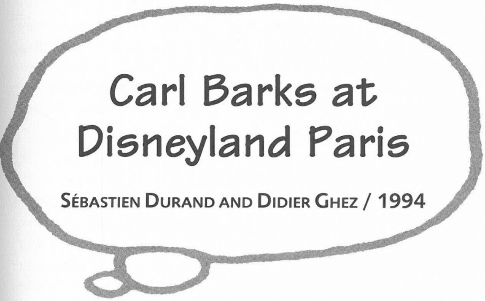

Previously unpublished interchange between Erik Svane and Carl Barks:

**ES:** Who do you think will inherit Scrooge's money?

**CB:** Probably Donald's nephews.

**ES:** Why would Huey, Dewey, and Louie receive it?

**CB:** Oh well, because they are so much more practical than Donald. In the later stories, as I developed those Duck people and the whole community of Duckburg and all of its problems, I began giving those kids much more intelligence than anybody else in Duckburg. And so I guess that when Uncle Scrooge passes on, he will leave all of his money to his three nephews [as Barks suggested, incidentally, in *Walt Disney's Comics and Stories* #155 (August 1953)]. And I'm sure they will do a lot of good in the world, their Junior Woodchucks organization, they will save all the birds and all the whales.

***

Conducted at Disneyland Paris, on 7 July 1994 and published as a link to "The Ultimate Disney History Network" (http://www.pizarro.net/didier/_private/interviu/barks.html). Reprinted by permission of Sébastien Durand and Didier Ghez.

**Sébastien Durand:** This is the first time that you have traveled outside the United States. You have seen many countries. How many countries have you visited to date?

**Carl Barks:** This is our number nine.

**SD:** And you still have many left?

**CB:** Yes, I have more to visit: Holland and England.

**SD:** I understand that you had no passport to leave the United States.

**CB:** Well, I had never had any use for a passport before and at the time I was born people lived many miles apart. I guess that when I was born, there was word gotten to a doctor about five miles away to come out and deliver a baby at this homestead. Whether he recorded it or not. . . . There was no place to record it because the county governments were pretty