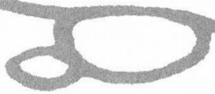

happen. Another one is a ten-page story of Donald, where he got to complaining about everything being too noisy and he moves to a very quiet place and he was not satisfied until everything was absolutely silent around him. He went around everywhere seeing if there was any noise he could pick up. Another story I wrote that I like is called "In Old California," where Donald and the kids went back in history before the Gold Rush. That had a lot of sentimental, easygoing stuff in it. It was not a funny story. It was just based on pathos. Another one I like that I wrote in the '60s was the "Micro Ducks from Outer Space."

**SD and DG**: Thank you Carl.

***

# Carl Barks Remembers "A Perfect Life"

Donald Ault and Lynda Ault / 1997

Excerpts from unpublished interviews conducted on 13–14 June 1997. Portions of this interview appeared in altered form under the title "From the Duck's Mouth" in the *Carl Barks* memorial issue of the *Comics Journal* #227, September 2000: 57–59. Transcribed from the original videotape interview and reprinted by permission of Donald Ault and Lynda Ault.

## Wives and Daughters

**DA**: Do I remember correctly that you said that your second wife used to tear up your comic books or something?

**CB**: Oh, yeah. Oh, yeah, well, she started out doing my blacking, solid blacks, and even ink the borders around the panels.

**DA**: Your second wife did this?

**CB**: Yeah, she did that for a while. And she had a—she came from a family that had a long record of alcoholism. And she just loved the taste of liquor. And so she kept drinking more and more, and finally she just got to the