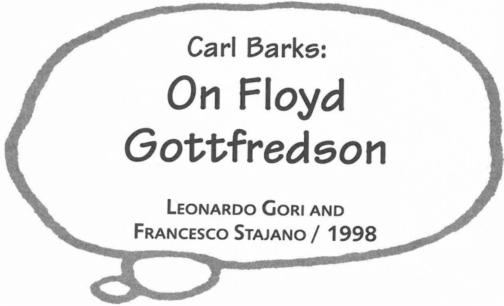

This interview was originally published in *Il grande Floyd Gottfredson* [*The Great Floyd Gottfredson*], Leonardo Gori and Francesco Stajano, Comic Art, 1998. Reprinted by permission of Leonardo Gori and Francesco Stajano.

**Q:** Let's first explore some comics "roots" that you may have in common with Gottfredson, and then if there was any more direct cross-fertilization of ideas between you two. You were born in 1901. The official consensus among comics historians places the beginning of the comics era at 1896, with *Yellow Kid*. Were comics already popular among young children when you were in grade school? Did you read any comics from the Sunday pages when you were a teenager? If so, which ones? Could you mention a few that you liked?

**CB:** The newspaper comic strips I liked as a teenager were mostly from the San Francisco papers. I am not sure if all the titles I quote were printed that early in the century. *Happy Hooligan*, *Katzenjammer Kids*, *Bringing up Father*, *Old Doc Yak*, Winsor McCay's *Little Nemo*. World War One slowed the creation of comic strips for many of the years I was a teenager.

***

**Q:** As far as we understand, people did not collect complete runs of comics at that time. But do you remember keeping a specific comic issue or newspaper or series of pages with a story that you particularly liked?

**CB:** I don't recall any evidence of people collecting comic strips in those early years. I kept no comics that I remember. They were too large and awkward to store.

**Q:** What got you interested in comics anyway? How come you got involved in drawing instead of sticking to the usual farm jobs?

**CB:** I got interested in the creation of comics because the job appeared to pay more salary and to be easier on the muscles than farm work.

**Q:** And what happened when you DID get your first cartoonist salary? We heard that Gottfredson was hired at $18/week. Was this a great disappointment? What kept you in comics then?

**CB:** I did not get directly into comics. At the Disney studio I was inducted into story script creation for the animated Duck cartoons. I had no time to even wonder if I would prefer working in Gottfredson's type of comic strip production.

**Q:** Putting comics aside for a moment: who were your favorite authors of written novels? Jack London? Fenimore Cooper? Mark Twain?

**CB:** I had little access to books in my early years and little time to read them. I read very little from the authors of the great classics. Fenimore Cooper is my favorite.

**Q:** In the late twenties and early thirties you were selling your own cartoons to the *Calgary Eye-Opener*. And were you still also a reader of comics at that time?

**CB:** In the 1920s many new comic strips were introduced. I read every one that I could get my hands on.

**Q:** The style of your artwork in that period (and also during the first few years of your duck comics) reminds us of that of *Popeye* by Elzie C. Segar; do you feel he had an influence on you?

**CB:** Elzie Segar's *Popeye* and other strips had a strong influence on my art style and humor creation.

**Q:** In 1929 the first version of *Tarzan*, by Harold Foster, came out. Very naturalistic. In the same year, *Buck Rogers* by Nowlan and Calkins came out as well, the first science-fiction comic. Did you read those?

**CB:** I read every *Tarzan*, *Buck Rogers*, and the like that I could buy. Also