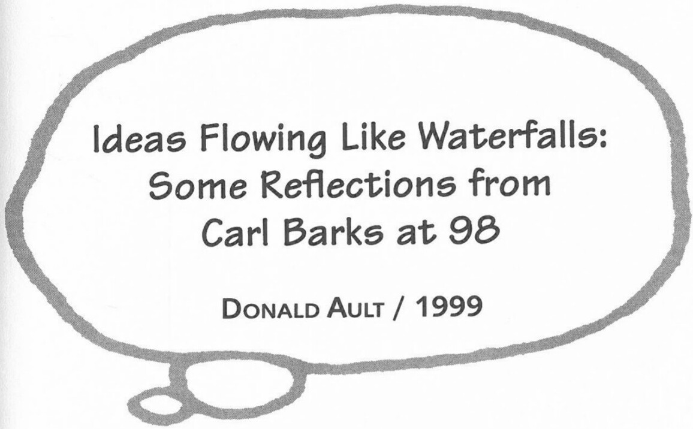

an army to go over there and kick somebody's butt. Just have to watch TV and hope we'll get some better news someday.

**JR**: So in the 1960s you were aware of what was going on in Southeast Asia?

**CB**: Oh, yeah. In the 1960s there was so much of that Viet Nam bank burning going on around the country. I realized what people were objecting to in that war, and I felt that someplace we have got to stop the communists or they're going to take over everything. It was something I couldn't do anything about, and I tried to make fun of some of those wars they had in Siambodia and such places. In "The Treasure of Marco Polo" I tried to turn things back, to make people think of the better times the people had before they got so damn mad that they were fighting all the time. Those stories were written at a time when I had kind of run out of ideas and would have to do a lot of fabricating on a plot that I didn't know too much about. They weren't my best stories.

**BH**: When you first realized that your stories were being translated into other languages, did that influence the types of stories you wrote?

**CB**: No. Not at all. I didn't try to think how the Danes were going to like it or the Swedes or anybody else—I was just drawing for my imaginary bunch of buyers—the people around who were living in America—the people who were buying my comics.

**DA**: You thought of your audience as primarily American and not international?

**CB**: No—I didn't think of them [my buyers] as international, but it happened that my stories fit any country in the world—they were that simple. The type of stories I wrote, the personalities—they had their duplicates in any country you'd go to.

**DA**: Do you like any contemporary comics?

**CB**: Well, I like the *Peanuts* strip very much.

**DA**: You once told me that there was too much thinking in *Peanuts*, that not enough was actually happening. I'm surprised that you say you really like it.

**CB**: Well, I guess I've gotten older.

***

Faxed interchange between Donald Ault and Carl Barks, 3 June 1999. Telephone conversation between Ault and Barks, 5 June 1999. Barks's handwritten responses, 22 July 1999. Reprinted by permission of Donald Ault.

### Cover Letter from Carl Barks Fax

Here are the answers to your questions. The task of remembering work I did fifty years ago revived in my aging mind the *real* motivation for all the diligence I spent in polishing stories and in drawing the ducks to the nearest perfection I could attain. The motivation was *money*.

In those days none of us at our drawing boards or in the offices of Western Publishing ever imagined the sale of "Funny Animal" comic books would last more than a few years. Western Publishing's top brass was quite obviously ashamed to be printing such trash on their mighty printing presses. My goal was to stretch my possible earning years by doing the most saleable work I could. After all, doing duck work was the easiest, most pleasant work I had ever done to earn money.