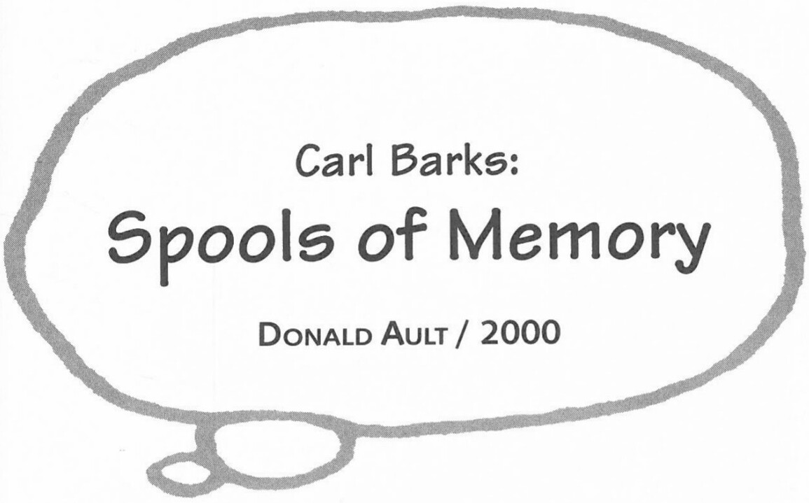

there every weekend to fix up the house and experiment with growing things. I knew the air conditioning in Disney's new Burbank Studio would wreck my health. The weekends at the sunny San Jacinto place persuaded me to prepare to try to live there full time. I guess it cooked some sense into my head. Later in 1942, after having painful surgery on my drippy nose, I made the break. Nov. 6, 1942.

**DA:** When and how did your second wife assist you in your work?
**CB:** My second wife's part in production of the finished art began slowly. That form of comic book work was new to me and to the editors. We had to try different paper sizes and types of drawing paper. I furnished the paper, buying it by the ream in a Hollywood art store. It was Strathmore high surface with lots of 'tooth' making it good for accented pen swooshes and good for gripping fine pointed brushes.

As I grew more loaded with production, I had my wife draw the orders of each page and also ink the borders [of the panels] when the duck drawings were finished. Later I had her paint in the solid blacks. The logos she also inked over top of my blue-line drawings. She never inked the characters or did any lettering.

***

From conversations on 18 June and 19 June 2000. Portions of this interview appeared in altered form under the title "From the Duck's Mouth" in the Carl Barks memorial issue of the Comics Journal #227, September 2000: 60. Reprinted by permission of Donald Ault.

## Comments made by Carl Barks to Donald Ault 6-18-00

*In the afternoon*

"When I look back on my work, I can't feel the confidence I had at that time, but I could just feel the confidence coming out of the ends of my fingers."

"Things fell into place for me easier than for others because I often had a whole panorama in my mind of what the story would be before I even put anything on paper."