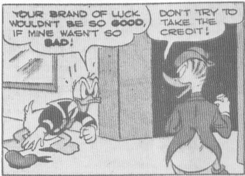
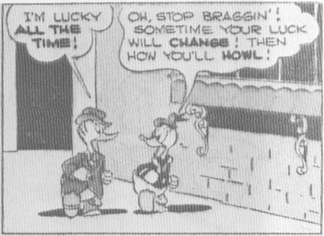
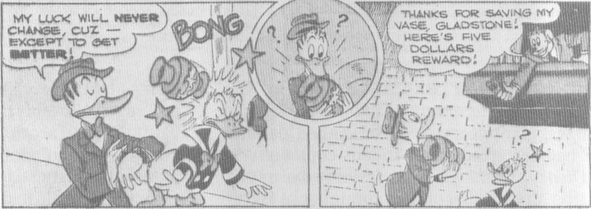
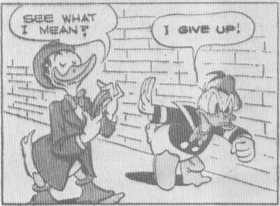
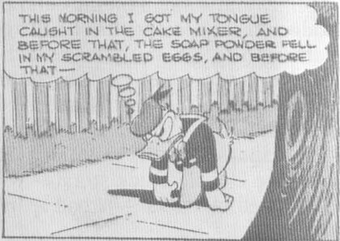
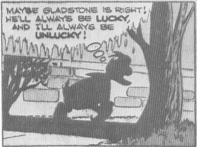
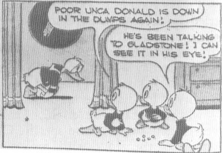

From *Walt Disney's Comics* No. 131, August 1951; © 1951 Walt Disney Productions.

Most often, when there was a new Barks comic book, I bought it; I can recall passing up only the 1950 Donald Duck issue about "The Pixilated Parrot," for reasons that I could not have articulated at the time, and cannot now

(although I am still cooler to that story than to others published that year).

So many more of my childhood memories revolve around Carl Barks's comic books. I can remember reading *Donald Duck in Ancient*