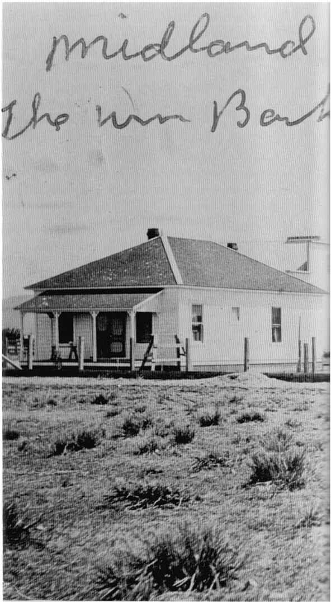

# II.

I WAS LUCKY: I was caught up by  Carl Barks's stories at their high tide.He was at  his best for five or six years in the late forties  and early fifties. By then, he had mastered his  medium, and he had not been overtaken by his  publisher's timidity and his own boredom. He  did memorable stories in both earlier and later  years, but his work was at its most intense and  exuberant at that time.

Barks was not an early bloomer. He backed into a comic-book career in 1942, when he was forty-one years old and still a story man at the Walt Disney studio. He had come to Disney's in 1935, after spending almost twenty years in grim and demanding jobs. Barks drew sparingly on his personal experiences when writing and drawing his duck stories — entertainment, and not self-expression, has always been his chief concern — but the harshness of his early years must have discouraged any sentimentality in those stories. Those dreadful jobs were even of some practical value in saddling Donald Duck with problems in the stories that Barks wrote many years later; as he explained in a 1968 letter, "The perversity of beasts, machines, and nature I knew by heart."

Carl Barks was born on March 27, 1901, near Merrill, Oregon. In 1973, he described his early years as follows:

"My folks had a little wheat ranch in southern Oregon, about two miles over the Califor-

The Barks ranch in Oregon in 1910.

nia line. My dad was a homesteader, and moved up there in the eighteen-eighties. He'd been a blacksmith and a teamster and so on, on those big grain ranches around Stockton, in the San Joaquin Valley, quite a number of years, and he had come there out of Missouri, as an orphan at the age of about fourteen. He had had a little apprenticeship as a blacksmith, and so he went to work on those big ranches. He worked there for many years, and