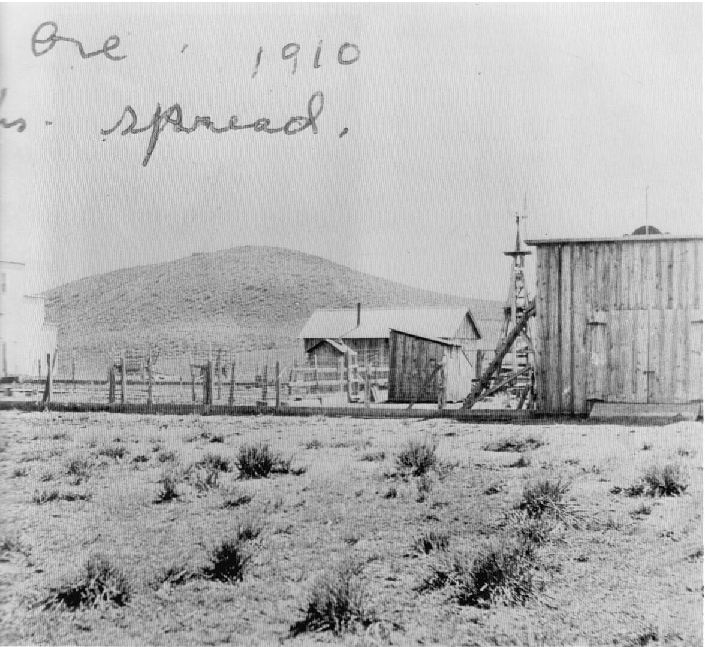

when he heard about the homestead land in Oregon, he went up there and took up a homestead of a hundred and sixty acres. He was very industrious at it, cleared the sagebrush off, and he got enough income out of his hundred and sixty acres to buy other hundred and sixties around him. By the time I came along, he had about a square mile of land, all in wheat, and doing all right.

"My father was forty-odd years old when I

was born. My mother was forty, too. She and my dad didn't get married until 1897, 1898, something like that. They had corresponded with each other a little bit over the years. She had had the problem of having to take care of her aged parents, who were not so much aged as they were ill. When they had finally passed on, I guess she wrote to my dad and said that she was free then, she could come out and marry him if he had gotten his homestead put