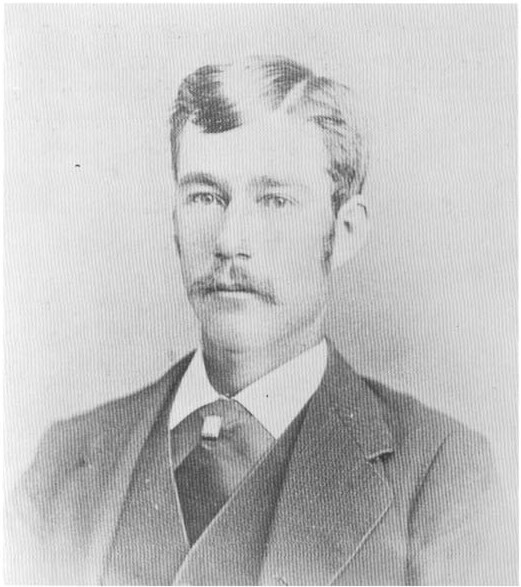
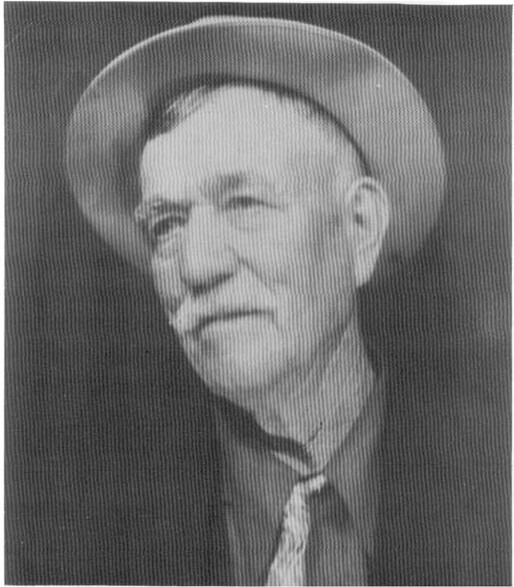

Carl Barks's father, William Barks, as a young man around the time he moved to California, and in old age. No photos of Barks's mother, Arminta Johnson Barks, are known to have survived. Barks's ancestors were Dutch on his father's side, and Scottish and English on his mother's side.

together. They had gone to school together as kids back in Missouri. They hadn't seen each other over all those years; he remembered her as a little tow-headed girl. She came out and they were married and a year or two later my brother was born, and then I was born, and that's the way life went.

would haul big wagon loads of straw out, and he would pitch it into the cars, and I would spread it around so there was a layer of straw about six or eight inches deep on the floor of the car. There were forty or fifty cars, and it would take us all day to get the straw into them.

"When the railroad first came into that part of Oregon, my dad could see where there was money to be made in establishing a feed lot for cattle to be shipped. When I was about seven years old, they moved from the ranch over to the town of Midland, on the railroad, and he put up some big corrals and feed lots, and we used to feed the cattle and bed down the shipping cars whenever these big trail herds would come in from eastern Oregon. You'd see the string of cattle coming through the gap in the hills off to the east, and it was a couple of hours before the tailers came through. They'd fill the corrals to bulging, and we had to go in there with wagons loaded with hay, and feed the cattle. My brother and I were principally concerned with bedding down the cars. We

"The cowboys all put up at the feed barn where my dad had stalls for their horses, and a sort of little bunk room for the guys to sleep. There was one hotel in town, but it didn't have enough rooms to take care of a whole string of cowboys. Those cowboys were tough fellows. They were used to having one little blanket roll rolled in stiff canvas on the backs of their saddles, and they'd just lay that out on the barn floor and sleep in that. My brother and I, we just worshipped those fellows. And oh, what vulgar-talking men they were! There was Skeeter Bill Robbins; he was a big, tall guy, skinny as a rail, and he was world champion bronc rider for a number of years back in those times. One was called Windneck Mitchell. He had a sort of goiter on the side of his neck, and