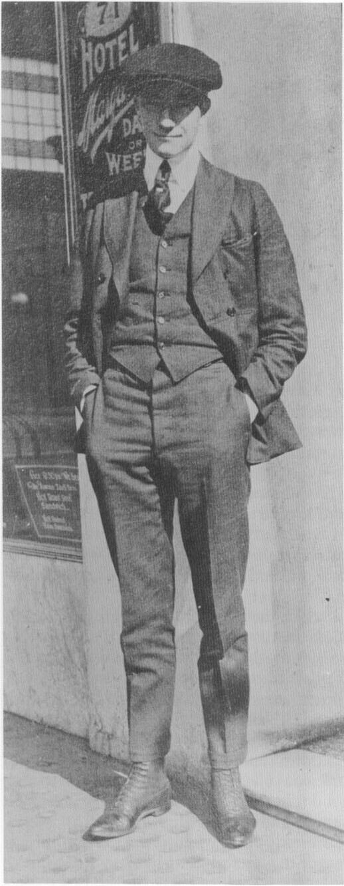

with good artists, and didn't need to take on any young kids. They'd glance at my samples, and give them back to me.

"I was with the little job printing outfit for a year and a half, something like that. Then I went back to Oregon and worked up there for a summer on the ranch. Then I came back to San Francisco for a few months. I was going to study show-card writing. I thought that might be a branch of drawing and semi-drawing I could get into that would not be so difficult as getting into newspaper work. I went to the YMCA show-card school, their night class, for a few lessons, and I soon found that the lettering came so hard for me, that that wasn't one of my natural talents. I used up all of my money and went back up to Oregon, and worked on the ranch again. Nothing would grow, so I had to work at something else."

In 1923, Barks married and left the ranch, spending the summer at a logging camp. From there, he and his wife drove in a second-hand Ford to Coalinga, in central California, in search of a job in the oil fields there.

"I just didn't like the looks of the oil fields, or the area they were in, and so we drove back up to Roseville [east of Sacramento], where there was a couple that my wife knew. This guy worked for the railroad, in the car shops. He said, 'Oh, hell, I can get you on at the car shops. All you have to do is just go over there, and I'll tell you who to talk to.' So I went over, and right away I got put on in the car shops. And there I was for over six years. I started out just swinging a sledge hammer, and common labor, and got put on to heating rivets on a riveting gang, and that was piecework. I was on that for five and a half years or so. God, I was getting sick of that."

(Barks's employer was the Pacific Fruit Express, which he described in a 1980 letter as "a refrigerated car system owned jointly by Union Pacific and Southern Pacific. Work was in the repairing of banged-up cars. I worked in the heavy steel section, which mostly re-

paired the steel underframes and wheel 'trucks.'")