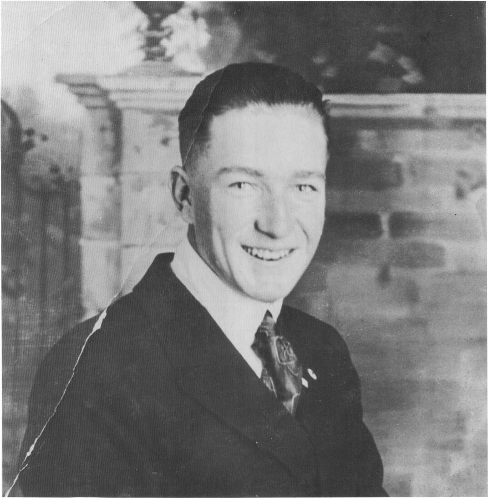

Carl Barks as a young man in San Francisco, just after the end of World War I.

Barks had never abandoned his hopes of becoming a cartoonist, and in 1928 and 1929 he began selling gag cartoons to the *Calgary Eye-Opener*, a mildly risque humor magazine that had originated in Canada, in 1902, but was published in Minneapolis by the time Barks started contributing to it. He also sold a few cartoons to the venerable *Judge*.

Barks was spending all of his spare time

drawing, and his wife did not share his ambitions; they separated early in 1930. (Barks's two daughters — one of them now deceased — were born during this marriage.)

Barks returned to Oregon, and worked briefly in a box factory until the Depression eliminated his job. In effect, the Depression made his decision for him: he finally became a fulltime cartoonist.