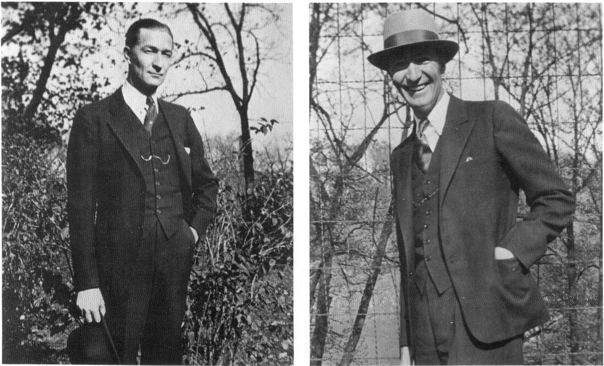

Carl Barks in 1932, when he was working for the *Calgary Eye Opener*.

Barks sent this drawing of his conception of Snow White and the Seven Dwarfs to the Disney studio when he applied for work in 1935.