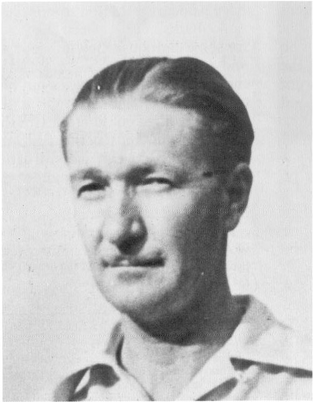

![A model sheet for the Disney animated short "Good Scouts" featuring Donald Duck and his nephews. The sheet includes character sketches, construction notes, and production credits. Text on the sheet includes: "Good Scouts", RM-13, © W.D.P. 10-7-37, DIRECTOR, STORY REEVES, ANIMATION MULLIN, TOMEY, BERRY, ALLEN, CANNON, HANNAH. Notes state: "NEPHEW'S HEAD IS THE SAME SIZE AS DONALD'S. THE LOWER BODY IS BUILT FROM A CIRCLE THE SAME SIZE AS THE HEAD BUT FLATTENED ON TOP." and "KID COMES APPR. TO DONALD'S SHOULDERS."](CBatAotCB-018_page_1_image_2_v2.jpg)

A model sheet for *Good Scouts*, one of Barks's first assignments as a Disney story man; ©1937 Walt Disney Productions.

Carl Barks in 1938.