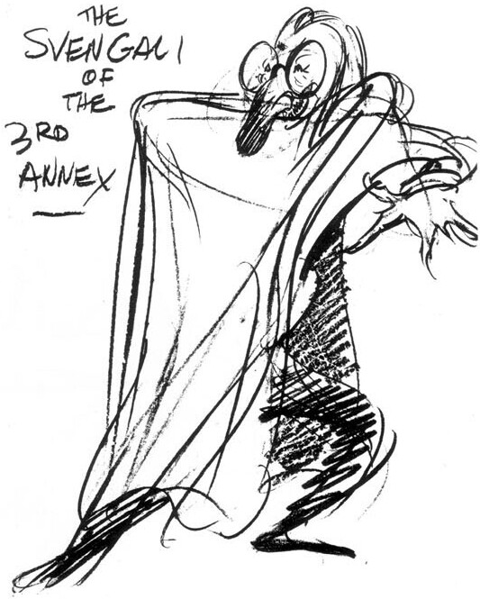

In a 1971 letter, Carl Barks commented on these caricatures of himself—all of them drawn by his colleagues in the Disney story department.

We story crews had chronic arguments going all the time over politics, art, music, and each other's dubious honesty. There were horse racing pools and football pools, also games of skillike lagging coins and throwing push pins. In some story units "gridirons"were drawn on the story boards, and pushpin throwers played a complicated game of "football" with expertly thrown "forward passes" and "line bucks." I was not athletic enough to participate in such rough sport, so my exercise was an occasional game of horseshoes at lunch hour.

The racing pools were much fun. Men from several units participated. Each paid a sum to place a bet across-the-board on a horse in races at Santa Anita and Hollywood Park. The total pool went to the guy whose oatburners earned the most money for the full day's program. You can guess that interest was keen when the sound of the bugle came out of a concealed radio in the "treasurer's" room. The radio would announce the finish order of the last race, and everybody would consult the pool board to see who had picked up the most money. You will see by the cartoons that I must have missed a $90 longshot once and took a terrific razzing.

By the caricatures I judge I was quite a character in some fields. My hooting at longhair music, Shakespearean writing, and modern art got me many lampooning cartoons. I was also evidently a whip- cracking old toiler at the grindstone. My associates lampooned me as a Reichsfuhrer general who demanded enormous diligence, and then sneakily blamed any poor story work on Nick [George] or Chuck [Couch] or someone other than myself. I wish I could remember the lampoons I must have fired back at my detractors. The paper we wasted! Good highest grade water-marked bond!

I was seldom involved in practical jokes—mostly because I was never associated in a story unit with the jokers of the place——Roy Williams, to name one. However, one joke was staged in the duck unit that may be worth relating. It was a complicated radio gag aimed at Harry Reeves, who was a supervisor of several story units at the time. World War II was on, and everybody under thirty-five was sweating out his draft call. Family men were still being exempted, and Harry was sitting pretty for that reason. In spite of the tension everybody was going around doing imitations of Roosevelt speeches, etc. Nick George became quite proficient at expounding: "Ah hate wahuh, Eleanauh hates wahuh.

One day we heard that some men in a layout unit had a small  radio sender that could broadcast on a standard wave length for  half a mile. Someone came up with the idea of doing a fake Roosevelt speech and broadcasting it to our room's radio. Nick and  I made a record at my home on my Philco recording phonograph,  and with the connivance of the layout men the record was put on  the air at a moment when we knew Harry Reeves would be in the  room. So when the moment came, Jack Hannah casually turned up  the radio volume and said word had just come over that F.D.R. was  about to make an emergency speech. Nick's voice came on in

perfect Roosevelt pomposity intoning: "Fellow Americans, mah friends. Ah hate wahuh! Eleanauh hates wahuh!" then launched into a speech about the need to expand the draft to include even family men. Harry was suspicious, to say the least. He said, "That's not F.D.R.; that's Nick." Then Nick walked into the room and stood listening beside Harry. At this point the gag was working beautifully. Harry could feel his draft status slipping away. But Nick and I had overdone the recording. When "F.D.R." called on Eleanor to say something profound to the worried people my voice came out doing my stock Eleanor bit: "How now, brown cow?"

Harry almost tore the place apart looking for the way the put on was put on. When he found it he grabbed the sending unit and record player and was off to the upper floors to pull the gag on anybody he could find sitting still. We almost had to hogtie him to save America's dignity. It was rapidly dawning on us that we jokers could get shot for defamation if any unapprised ears had caught the broadcast.

I doubt that I can recall any more items of interest. The years at the studio were much more work than play. I was the workhorse type that missed most of the fun and the gossip. I didn'teven see the celebrities that came and went. Stravinsky, Stokowski, and Snow White passed along the halls while I bent over my drawing board looking as if I was creating my wages worth.