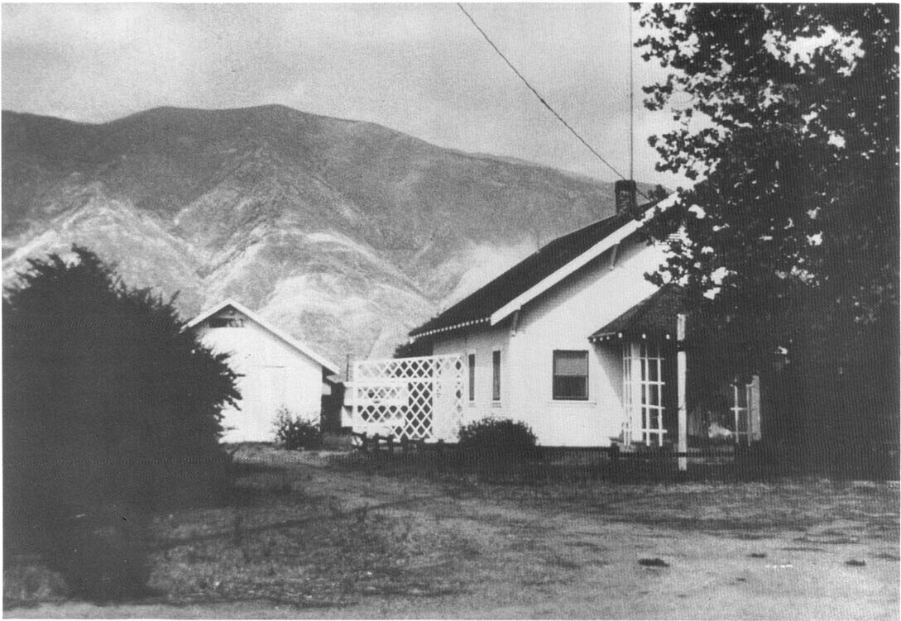

Barks lived and worked in this house in San Jacinto from 1942 to 1951.

where gags were everything. Jack Hannah said in 1976 that Barks had "a natural talent for cartoon work," but it was still developing; as Hannah also remarked, "Some of it was too far out sometimes; you'd have to watch him on continuity." While he was at the Disney studio, Barks was not a consummate story-teller, and he showed few signs of becoming one.

The single most important inhibiting factor may have been Donald Duck's screen personality, which was already well established by the time Barks became a Disney story man. Even though Donald had first appeared only about two years earlier, in a 1934 Silly Symphony called *The Wise Little Hen*, he was pegged as a terrible-tempered little quacker in his second film, *Orphans' Benefit*, and it was that basic pattern that Barks had to work with. Rather than Barks influencing the course that Donald took on the screen, it was the other
way around; it is the screen Donald we see in the first few years of Barks's comic-book stories. I have always found the screen Donald an unattractive character — he is too much the stupid bully and practical joker — and until Barks began to transform him into a much richer, funnier character, the comic-book stories were held down as if by lead weights.

It seems unlikely that Barks could have effected a similar change in the animated Donald if he had remained at the studio. His future at Disney's was limited. His lack of animation experience — and what he describes as his inability to picture a story in his mind as if it had already been animated — would have prevented him from ever becoming a director. He was pigeonholed as a "duck man"; he worked briefly with Chuck Couch and Ken Hultgren on *Bambi*, but then was ordered back to work on duck pictures.