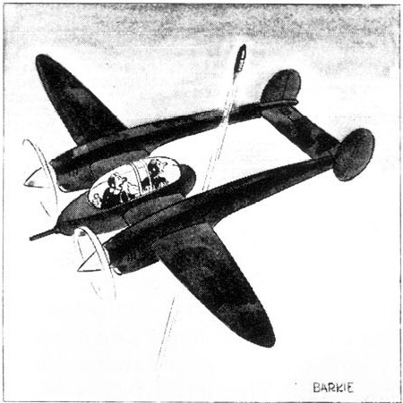
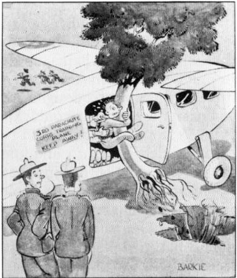

"Now do you see why they designed it this way?"

"They're having a little difficulty getting volunteers for the parachute corps . . ."

These cartoons by Barks were published in *Flying and Popular Aviation* magazine in 1941, while he was still on the Disney studio's staff; ©1941 *Flying and Popular Aviation*.

protested — "I felt that I was in with the guys who were really producing the future" — but to no avail. "Maybe it was six weeks I was on that; I don't think we produced one single thing that ever appeared in the movie." Couch and Hultgren continued to work on the story for *Bambi*, but little of their material reached the screen.

When Barks and I were talking in 1973 about his work on *Bambi*, he described a gag that he and Couch had devised. It is apparently the gag that is reproduced in Robert D. Feild's 1941 book, *The Art of Walt Disney*, as Plate 26, "The Way to Crack a Nut": a squirrel tells a chipmunk to crack a nut in the fork of a limb, and the chipmunk tries to crack the nut while it is still in his mouth. Hultgren, as a "story sketch man," made the nine finished sketches for this gag from rough sketches by Barks and Couch. This was a luxury that Barks had not enjoyed on the Duck shorts, where his own rough sketches were used on the storyboard. ("We never made beautiful layouts or things like they did for *Snow White*, where they had draftsmen working with the different story men, and each gag man had his draftsman who

did a beautiful, detailed drawing of the simplest gag. If it was nothing more than Dopey wriggling his nose, there was a two-thousand-dollar painting.")

When Barks and I were looking at the plate in the Feild book, he suggested another reason why his departure from the Disney studio was inevitable. "These guys who could visualize stuff in action," he said, "they were much better at thinking up that type of gag than I was."

What type of gag came most naturally to him? I asked.

"Well," he said. "I would have thought of the gag, but I wouldn't have seen all of these sketches as being necessary in putting it over." He would have drawn one sketch, he said, "and that would have been it."

In other words, he was more interested in getting an idea across in a single drawing than in elaborating it in a series of drawings. He summed up his attitude neatly in a 1977 letter: "I was a plot man. Animation gags were long and tiresome to me. I wanted to see movement from one situation to another rather than movement revolving endlessly within one situation."