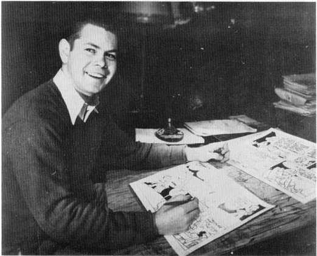

changes. Well, I did, and I think I sent the roughs of those changes back. She looked them over, and sent back word to go ahead with my original version, [because] my original version was better. After that, I never had any trouble."

Fortunately for him, and for his readers, Barks had begun working for Western when comic books were still new, innovations were still possible, and taboos were not oppressive. Ten years later, many of Western's comic books would look, and read, like the work of prissy, humorless robots, but by then, Barks's status as (in the words of Charles Beaumont) "the Dalai Lama of scriptsters" was secure. He suffered from the changed climate, but for the most part indirectly; he never had to endure the indignity of clearing his ideas with the office.

He did have to endure an indignity of another kind in the forties, however. Roger Armstrong, who wrote and illustrated many stories for Western then, described the "showings" at Western's offices in a 1967 letter:

"My recollections of Carl Barks go back to the days when I was barely out of my teens and landed my first honest-to-God comic strip (book) job with what was then the Whitman

Roger Armstrong in late 1941 or early 1942, working on "Mary Jane and Sniffles" for *Looney Tunes No. 8*

Publishing Company. In those days there was a ritual in the Beverly Hills office, to which we all wended our ways with our assorted bundles of 'Porky Pigs,' 'Sniffles and Mary Janes,' etc., etc., ad nauseum — a ritual which I am convinced was nothing less than a refinement of the worst excesses of Torquemada at the height of the Spanish Inquisition! This ritual was called 'The Showing' — a harmless enough title on the face of it, but fraught with such agonies for the victim that my mind boggles at the mere recollection of it. The ritual consisted of the hapless cartoonist being taken to the inner office, the sanctum sanctorum of the Big Boss, a hard-driving lady named Eleanor Packer. She would plump herself down in a great soft chair in front of a large board of directors-type table. All the other people who were in the outer offices — secretaries, clerks, flunkies of all sorts and, most horrible of all, any fellow cartoonists who happened to be in the office, bringing in their stuff — were all summoned and grouped about the table. Then the art editor, a fellow with a waspish tongue (and a helluva fine cartoonist) named Carl Buettner (since deceased, God rest his soul) would read — read out loud, mind you — the material spread out there on the table, that miserable extension of yourself that you had labored over for weeks, and all and sundry were invited to comment, look for mistakes, offensive dialogue, errors in punctuation, unclear drawing, anything, in short, that would confuse a five-year-old child. I will say one thing for the device: after a short apprenticeship at that outfit, there wasn't any comic book outfit, syndicate, etc., one could go to work where you wouldn't be the shining light of draughtsmanship, and one ended up an expert on the (written) English language. I honestly owe the great strides my drawing took in those days to 'the showing.' But it was no fun while it was going on!

"All this preamble to get to Carl Barks. Any of us fortunate enough to be on tap in the office on those days when Carl and his wife