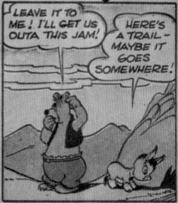
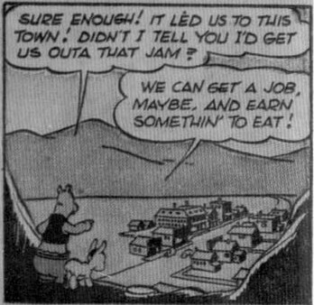
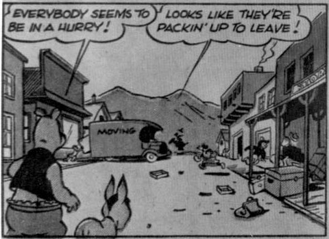
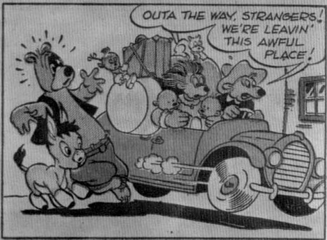
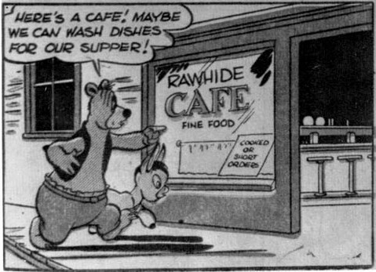
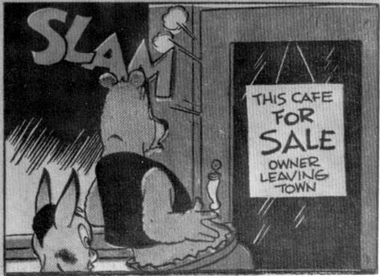

**B**ARNEY HAS PERSUADED BENNY TO SET OUT WITH HIM TO SEE THE WILD WEST, BUT ALL IS GOING BADLY—BARNEY DIDN'T BRING ANYTHING TO EAT, OR MONEY TO BUY ANYTHING TO EAT, OR A ROAD MAP TO GUIDE THEM TO ANYTHING TO EAT! THEY'D GLADLY GO HOME, BUT THEY DON'T KNOW THE WAY—BARNEY DIDN'T BRING A COMPASS!

**Barney**: LEAVE IT TO ME! I'LL GET US OUTA THIS JAM!
**Benny**: HERE'S A TRAIL—MAYBE IT GOES SOMEWHERE!

**Barney**: SURE ENOUGH! IT LED US TO THIS TOWN! DIDN'T I TELL YOU I'D GET US OUTA THAT JAM?
**Benny**: WE CAN GET A JOB, MAYBE, AND EARN SOMETHIN' TO EAT!

**Barney**: EVERYBODY SEEMS TO BE IN A HURRY!
**Benny**: LOOKS LIKE THEY'RE PACKIN' UP TO LEAVE!

**Driver**: OUTA THE WAY, STRANGERS! WE'RE LEAVIN' THIS AWFUL PLACE!

**Barney**: HERE'S A CAFE! MAYBE WE CAN WASH DISHES FOR OUR SUPPER!
**Sign**: RAWHIDE CAFE FINE FOOD COOKED OR SHORT ORDERS

**Sound Effect**: SLAM!
**Sign on door**: THIS CAFE FOR SALE OWNER LEAVING TOWN