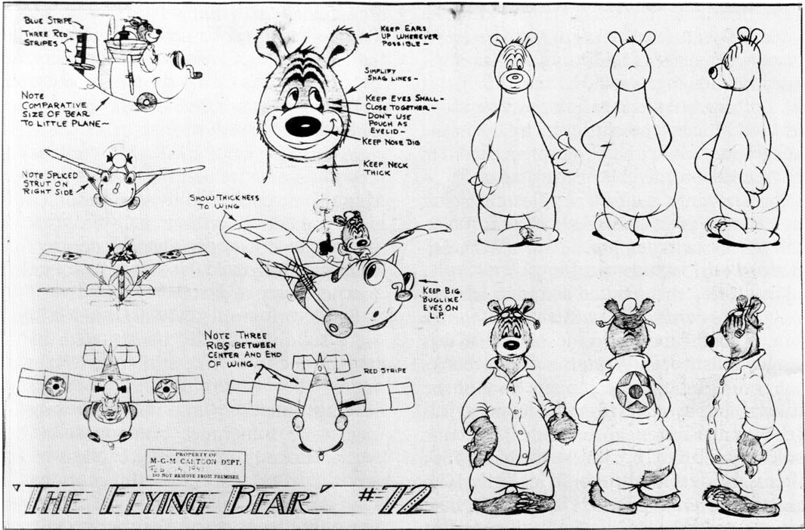

From Our Gang Comics, No. 11, May-June 1944, the first issue in which Barks worked with Barney Bear and Benny Burro as a team; and one of the model sheets that Barks used in drawing Barney. © Loew's Inc.

Although Barks is associated indelibly with the Disney ducks he was assigned some stories with other characters during his first five years with Western. He did single stories with Andy Panda, Mickey Mouse, and Porky Pig, and none of them come even close to ranking with his best work.

His most enduring association was with Barney Bear and Benny  Burro, whose stories he drew for Our Gang Comics from 1944 to  1947 (he drew three stories with Benny alone before working with  Barney and Benny as a team). Although these stories sometimes approach the duck stories of the middle forties in quality, Barney Bear was too limited a character to engage Barks's interest in the way  that Donald Duck did. Barney was merely stupid; he was not stupid  in Donald's grand, energetic way. Even so, the Barney-and-Benny  stories do work well when Benny is played as Barney's sensible long-suffering foil; they don't work when Benny's stupidity causes

problems. In its last year or so, the series became highly mechanical In part this was because Barks wasn't writing most of these stories, but only illustrating them; but it seems obvious, too, that Barks had exhausted his interest in the characters.

The most tantalizing of Barks's non-duck stories are the two he did for Our Gang with a character he called Happy Hound, but who is actually Droopy. (Barks wrote several Droopy stories in the early fifties—probably because someone remembered that he had done the two for Our Gang years before— but they are ordinary comic-book stories.) The Happy Hound stories have a strong burlesque flavor that is not that common in Barks's stories, and Happy himself is an intriguing character— his low-key approach to life contrasts humorously with the ho-hum military precision of the other hounds atthe prison where Happy is a guard dog.