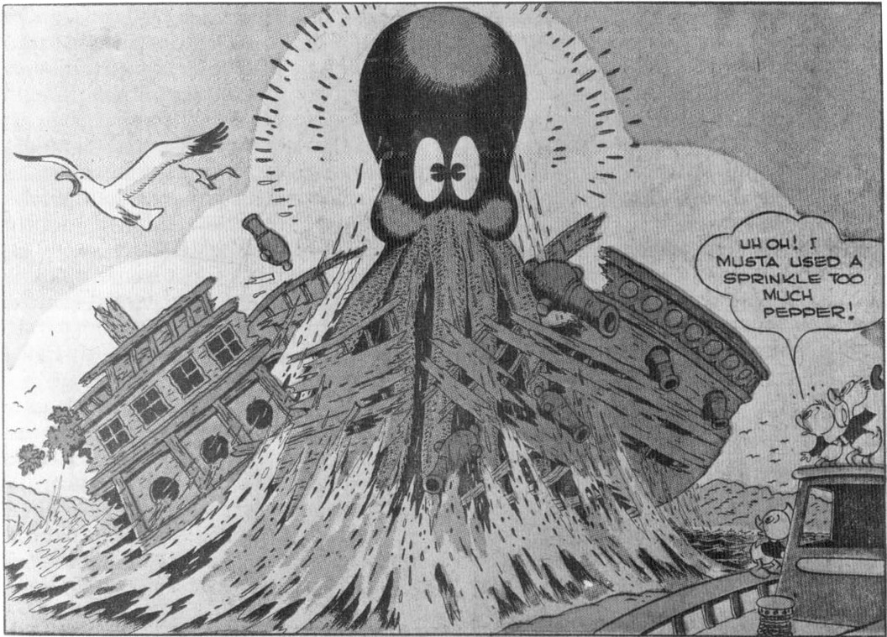

From "The Ghost of the Grotto" in *Donald Duck Four Color* No. 159, 1947; © 1947 Walt Disney Productions.

encompassing as much time as required to get its point across. His stories developed a much more supple and ingratiating rhythm than before, as Barks achieved flexibility not only by toning down the action in his stories, but by bringing the dialogue and the drawings into better balance.

He preserved this balance even when the temptation to do otherwise must have been severe. To jump ahead a bit: in 1947, Barks began using spectacular half-page panels in some of his stories. The first of these was in a story in *Donald Duck* called "Ghost of the Grotto." In this story, the ducks are trying to rout a giant octopus that is lurking in the ruined hulk of an old galleon, and they feed him a chunk of meat wrapped around a heavy dose of chili pepper. The octopus eats the meat and then, in that wonderful half-page panel,

rises straight up in the air, stunned, shattering the galleon, as the ducks watch. Barks could have settled for the drawing alone, but instead he gave a bit of dialogue to the nephew who seasoned the bait: "Uh oh! I musta used a sprinkle too much pepper!" It's a funny line that is funnier because of its understatement, and the contrast makes the drawing funnier, too. What could have been a spectacular and amusing drawing — and little more — without the dialogue has become instead an integral part of the story, because Barks has asserted the importance of the dialogue. The weight assigned to art or dialogue shifts from panel to panel — in this story and in all the rest — but the basic balance is rarely disturbed.

This new technical mastery wouldn't have counted for much, though, if Barks hadn't used it to tell more interesting stories than his