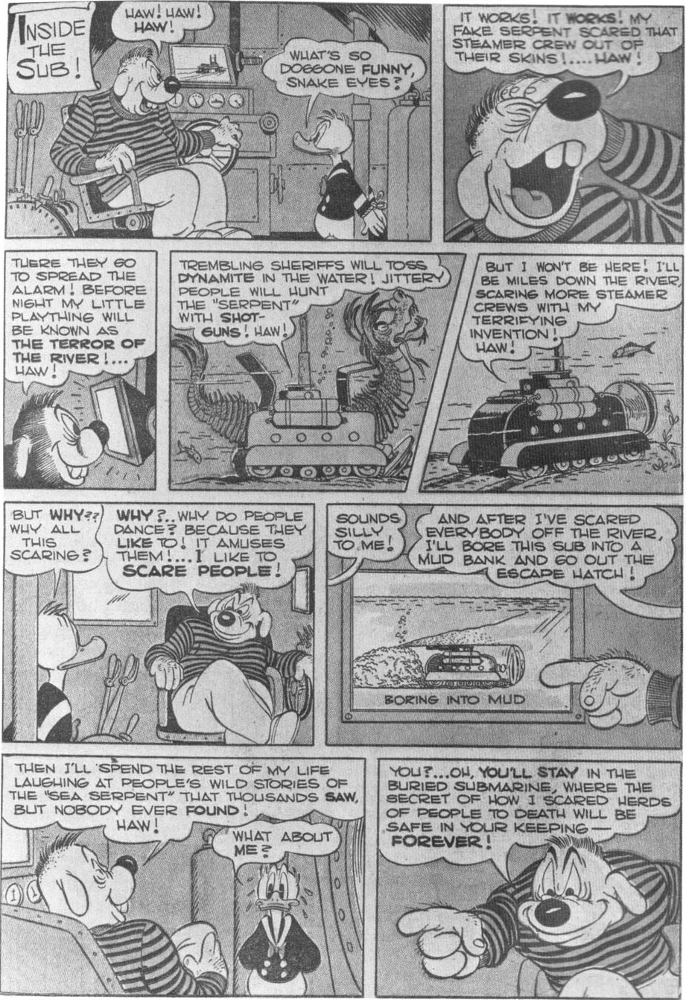

**INSIDE THE SUB!**

**Panel 1:**
[Villain]: HAW! HAW! HAW!
Donald Duck: WHAT'S SO DOGGONE FUNNY, SNAKE EYES?

**Panel 2:**
[Villain]: IT WORKS! IT WORKS! MY FAKE SERPENT SCARED THAT STEAMER CREW OUT OF THEIR SKINS!.... HAW!

**Panel 3:**
[Villain]: THERE THEY GO TO SPREAD THE ALARM! BEFORE NIGHT MY LITTLE PLAYTHING WILL BE KNOWN AS THE TERROR OF THE RIVER!... HAW!

**Panel 4:**
[Villain]: TREMBLING SHERIFFS WILL TOSS DYNAMITE IN THE WATER! JITTERY PEOPLE WILL HUNT THE "SERPENT" WITH SHOTGUNS! HAW!

**Panel 5:**
[Villain]: BUT I WON'T BE HERE! I'LL BE MILES DOWN THE RIVER, SCARING MORE STEAMER CREWS WITH MY TERRIFYING INVENTION! HAW!

**Panel 6:**
Donald Duck: BUT WHY?? WHY ALL THIS SCARING?
[Villain]: WHY?.. WHY DO PEOPLE DANCE? BECAUSE THEY LIKE TO! IT AMUSES THEM!... I LIKE TO SCARE PEOPLE!

**Panel 7:**
Donald Duck: SOUNDS SILLY TO ME!

**Panel 8:**
[Villain]: AND AFTER I'VE SCARED EVERYBODY OFF THE RIVER, I'LL BORE THIS SUB INTO A MUD BANK AND GO OUT THE ESCAPE HATCH!
[Diagram showing the submarine]: BORING INTO MUD

**Panel 9:**
[Villain]: THEN I'LL SPEND THE REST OF MY LIFE LAUGHING AT PEOPLE'S WILD STORIES OF THE "SEA SERPENT" THAT THOUSANDS SAW, BUT NOBODY EVER FOUND! HAW!
Donald Duck: WHAT ABOUT ME?

**Panel 10:**
[Villain]: YOU?... OH, YOU'LL STAY IN THE BURIED SUBMARINE, WHERE THE SECRET OF HOW I SCARED HERDS OF PEOPLE TO DEATH WILL BE SAFE IN YOUR KEEPING — FOREVER!

From "The Terror of the River" in *Donald Duck Four Color* No. 108, 1946, © 1946 Walt Disney Productions.