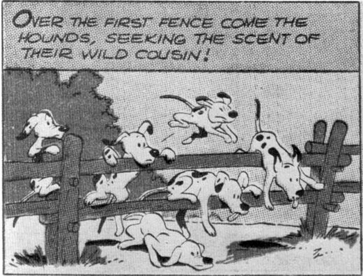
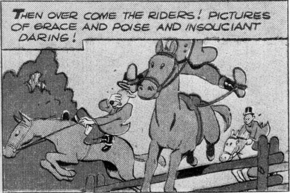

precise — and this becomes apparent only when Barks's stories are read, rather than just looked at. Barks was a writer first and an artist second, and his drawings have life because they are in the service of characters and ideas.

In the late forties, Barks turned increasingly to comedy that hinged as much on what the ducks thought and felt as on what they did. He had learned how to make states of mind clearly visible. There were wonderful sequences in which the "action" consisted almost entirely of subtle — but unmistakable — changes in the expression on Donald's face. "Luck of the North," in a 1949 issue of *Donald Duck*, contains one of the best examples of this. Donald has won what appears to be a triumph over Gladstone, by sending him on a wild-goose chase to the Arctic, but in a page and a half of remarkable drawings, Donald's satisfaction disintegrates into guilt and anxiety, as he realizes that he may have purchased his triumph at the cost of Gladstone's life. Work of this kind was beyond the abilities of most comic-book artists, even those who were, as draftsmen, Barks's superiors; their work looks like shorthand when set beside his.

I have talked about Barks as a writer, and about the increasing importance that dialogue assumed in his stories, and yet I have not quoted that dialogue, except incidentally. It is

really not fair to pluck Barks's dialogue out of context, as if he were a playwright. He wrote his dialogue to be read within comic-book panels, and words that seem crisp and sassy in that context may have a flat taste when read apart from the drawings. The dialogue in Barks's earliest stories is rather flat and ordinary even for comic books; it is sparse and functional, subordinate to the almost purely visual gags. But as his work evolved in the forties, he realized, I think, that comic-book dialogue can be richer precisely because it accompanies pictures. If the pictures tell much of the story, and if the story itself is compelling, it doesn't really matter if some of the words in the dialogue balloons are unfamiliar. The child reader will be tantalized by them rather than repelled. The writer of children's books, on the other hand, must not put too many verbal obstacles in his young reader's path, because there are no pictures — or at least not as many — to make clear what the words mean.

The comic-book writer can really let himself go in his captions, especially if they are simply comments on what the panels clearly show. Take for example the Donald Duck story in the November 1948 *Walt Disney's Comics*, in which Donald is a fox hunter. These captions accompany three panels of bumbling fox hunters and their bumbling

From *Walt Disney's Comics* No. 98, November 1948; © 1948 Walt Disney Productions.