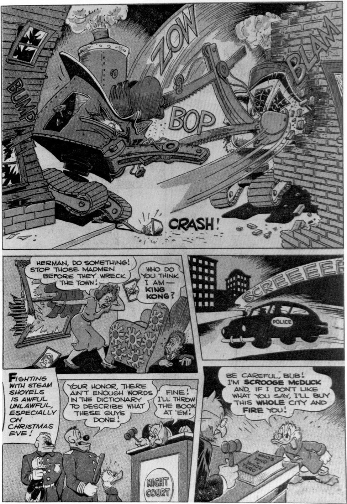

**Panel 1:**
[Sound effects]: BUMP, ZOW, BOP, BLAM, CRASH!
(Two steam shovels are shown violently colliding and smashing into brick buildings.)

**Panel 2:**
Woman: HERMAN, DO SOMETHING! STOP THOSE MADMEN BEFORE THEY WRECK THE TOWN!
Herman: WHO DO YOU THINK I AM— KING KONG?

**Panel 3:**
[Sound effect]: SCREEEEE!
(A police car speeds through the city streets at night.)

**Panel 4:**
Narrator: FIGHTING WITH STEAM SHOVELS IS AWFUL UNLAWFUL, ESPECIALLY ON CHRISTMAS EVE!
(Two police officers stand with a captured Donald Duck.)

**Panel 5:**
Police Officer: YOUR HONOR, THERE AIN'T ENOUGH WORDS IN THE DICTIONARY TO DESCRIBE WHAT THESE GUYS DONE!
Judge: FINE! I'LL THROW THE BOOK AT 'EM!
(The scene is set in NIGHT COURT.)

**Panel 6:**
Scrooge McDuck: BE CAREFUL, BUB! I'M SCROOGE McDUCK AND, IF I DON'T LIKE WHAT YOU SAY, I'LL BUY THIS WHOLE CITY AND FIRE YOU!

From Christmas Parade No. 1, 1949; © 1949 Walt Disney Productions.