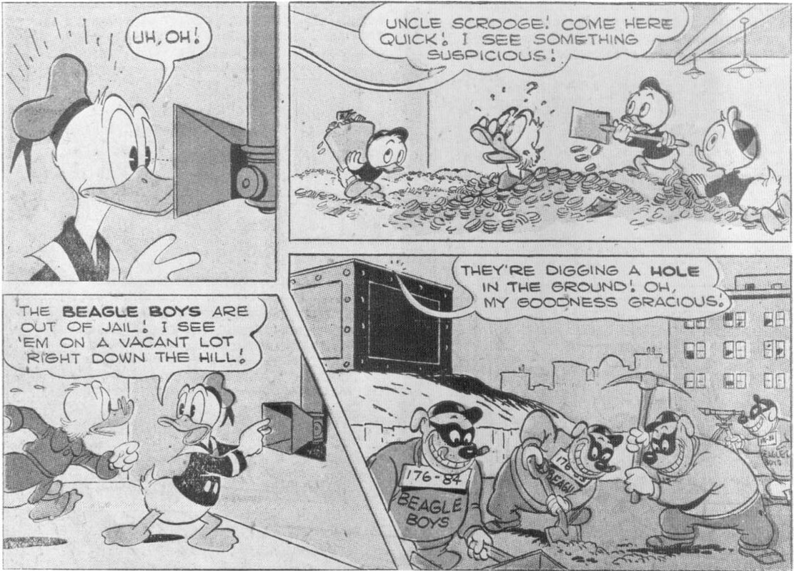

From Walt Disney's Comics No. 135, December 1951; © 1951 Walt Disney Productions.

broadcloth coat, which we are told in a later story he bought in Scotland in 1902.

Scrooge's love for money soon turned into something like lust. Before, he was simply surrounded by money; now he wallowed in it. "I wish people weren't so darned crazy about money," he says at one point. "They make me nervous." He surveys his vast pile and says, "Now, me, I know money isn't worth anything! It's just a lot of paper and metal." And then he plunges into the cash with wild abandon. "But I love the stuff! I love to dive around in it like a porpoise! And burrow through it like a gopher! And toss it up and let it hit me on the head!"

In another story, Donald asks Scrooge what he plans to do with all of his money. "Why, I'm going to keep it right here, of course!" Scrooge replies hotly. "I just like to look at it! And I like

to run around in it in my bare feet and feel thousand dollar bills crackling between my toes!"

"People that spend money are saps!" he says as he roots and snorts contentedly in the stuff. "They don't know how to enjoy it."

Scrooge's money bin and the Beagle Boys arrived on the scene, appropriately, at almost the same time. The Beagle Boys — a grinning gang of domino-masked burglars so accustomed to prison that they went by numbers instead of names — made their debut in the November 1951 Walt Disney's Comics, but only in the last panel, scooping up Scrooge's money after he accidentally blew open his vault. The money bin — a square building many stories high, and full to the brim with cash — first appeared in the next issue of Walt