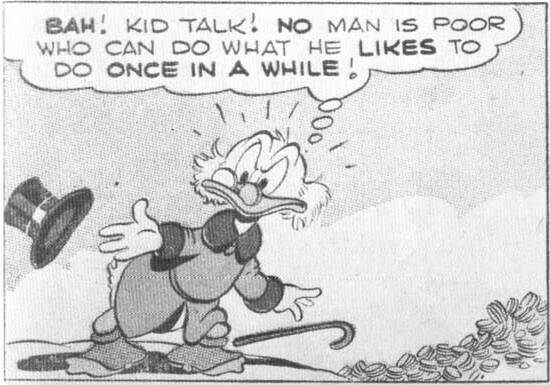
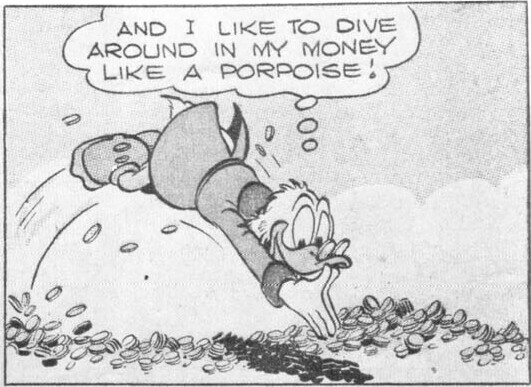
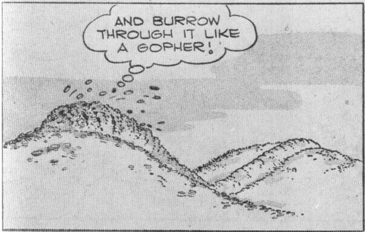
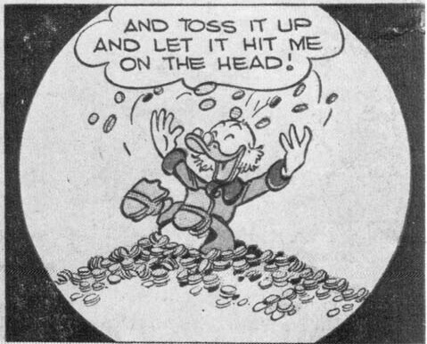

From Uncle Scrooge Four Color No. 386, 1952; © 1952 Walt Disney Productions.

Disney's Comics, and the plot hinged on the Beagle Boys' efforts to crack it (as many plots were to later). Here, as in the November issue, Scrooge saved them the trouble, by taking Donald's bad advice.*

The Beagle Boys acquired a real group personality a few months later, in the first issue of *Uncle Scrooge* (1952). In "Only a Poor Old Man," the story that takes up the entire comic book, the Beagles are revealed as the perfect foils for Scrooge. Like him, they're monomani-

acs, fully as devoted to Scrooge's fortune as Scrooge himself is. They expend as much time and energy trying to steal it as Scrooge does protecting it. The big difference is that the Beagles are interchangeable organization men (they became "Beagle Boys, Inc." in that story, as proclaimed on their shirtfronts) and not rugged individualists.

"Only a Poor Old Man" marks a major change in Scrooge, too. This is, after all, Scrooge's story; he is the hero, battling a set of unmistakable (although comic) villains. But because he is the hero, rather than a supporting character in a Donald Duck story, he can't be quite the same incorrigible old capitalist as before.

Scrooge in his supporting appearances was not an especially sympathetic character. If

\*It took a while for the money bin to become a fixture. It is absent from the stories starring Scrooge in the March 1952 and September 1952 issues of *Walt Disney's Comics*, and also from the first few issues of *Uncle Scrooge*, although Scrooge's vault is labeled "money bin" in a few of these stories. The "true" bin first reappeared in *Walt Disney's Comics* in the August 1953 issue and in *Uncle Scrooge* in No. 9 (1955).