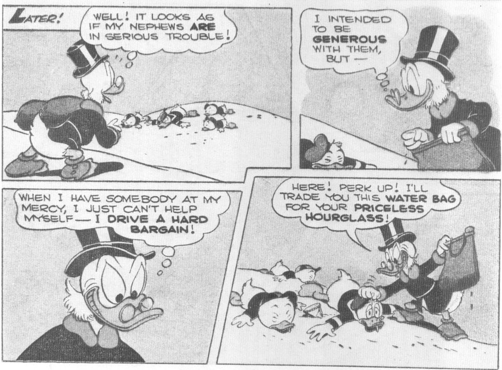

From Donald Duck Four Color No. 291, 1950; © 1950 Walt Disney Productions.

never quite a villain, he was frequently at odds with Donald and the nephews. In "The Magic Hourglass," (1950), for instance, he gives the nephews an hourglass that he later discovers is the enchanted source of his great wealth. The bulk of the story is taken up by his efforts to get the hourglass back, by fair means or foul. He finally regains it when he finds the ducks dying of thirst in the Sahara Desert and trades them a water bag for the hourglass. Scrooge is punished for his greed a short while later, but, still, the fiendish expression on his face when he makes the trade is not the sort to win the heart.

The Scrooge of "The Magic Hourglass" differs from the later Scrooge in many respects. This is almost the only story after "Letter to Santa" in which Scrooge's money is not highly

visible; he is surrounded instead by the trappings of a big-wheel executive. Most important, the story turns on luck — Scrooge has accumulated his fortune less through his own efforts than through the magic of the hourglass. "The Magic Hourglass" remains a wonderful story, but it is a story in which Donald and the nephews are the sympathetic characters; it would not have been successful if Barks had asked that we cheer for Scrooge, instead of simply enjoying his energy and irascibility.

The Scrooge of "Only a Poor Old Man" is a much warmer-hearted soul than the Scrooge of "The Magic Hourglass"; he loves money no less, but he is not so greedy for more. Early in the story, he explains to the nephews why it is that he loves his money so much: "I made it on the seas, and in the mines, and in the cattle