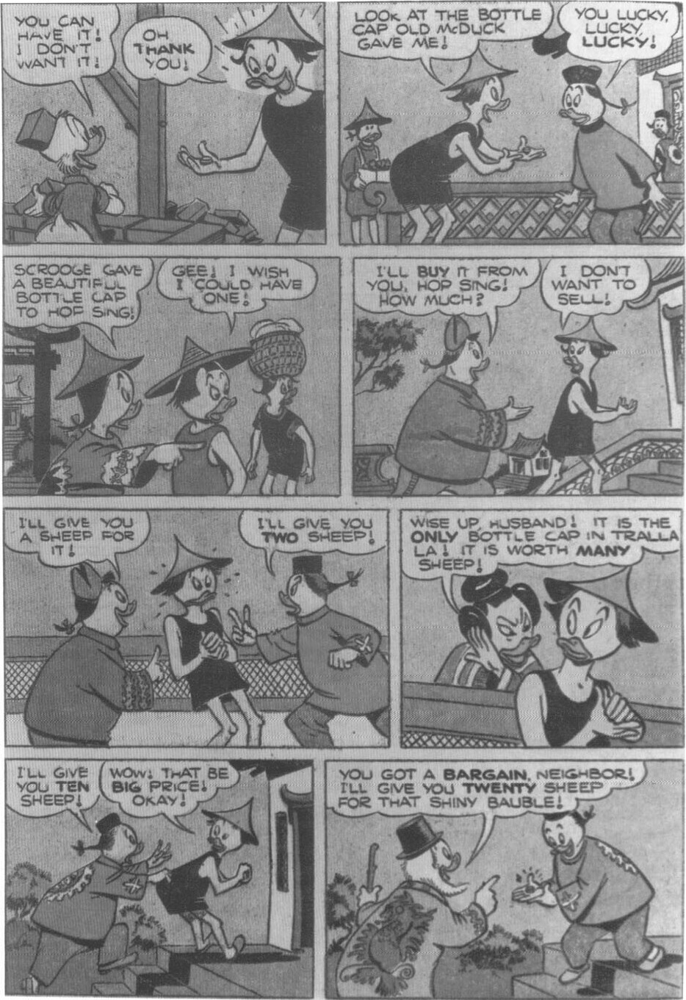
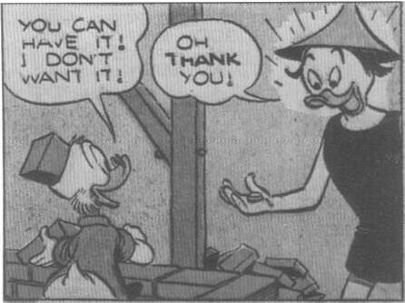
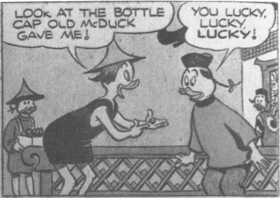
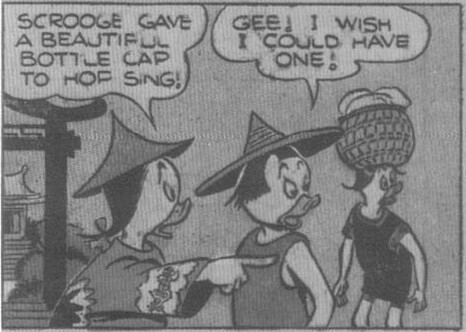
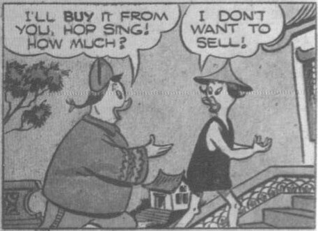
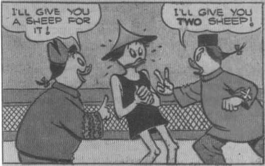
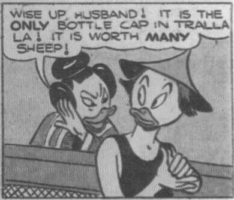
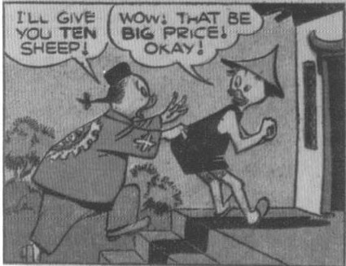

**Scrooge:** YOU CAN HAVE IT! I DON'T WANT IT!
**Resident:** OH THANK YOU!

**Resident:** LOOK AT THE BOTTLE CAP OLD McDUCK GAVE ME!
**Others:** YOU LUCKY, LUCKY, LUCKY!

**Hop Sing:** SCROOGE GAVE A BEAUTIFUL BOTTLE CAP TO HOP SING!
**Other:** GEE! I WISH I COULD HAVE ONE!

**Man:** I'LL BUY IT FROM YOU, HOP SING! HOW MUCH?
**Hop Sing:** I DON'T WANT TO SELL!

**Man 1:** I'LL GIVE YOU A SHEEP FOR IT!
**Man 2:** I'LL GIVE YOU TWO SHEEP!

**Woman:** WISE UP, HUSBAND! IT IS THE ONLY BOTTLE CAP IN TRALLA LA! IT IS WORTH MANY SHEEP!

**Man:** I'LL GIVE YOU TEN SHEEP!
**Hop Sing:** WOW! THAT BE BIG PRICE! OKAY!

**Neighbor:** YOU GOT A BARGAIN, NEIGHBOR! I'LL GIVE YOU TWENTY SHEEP FOR THAT SHINY BAUBLE!

From Uncle Scrooge No. 6, June-Aug. 1954; © 1954 Walt Disney Productions.