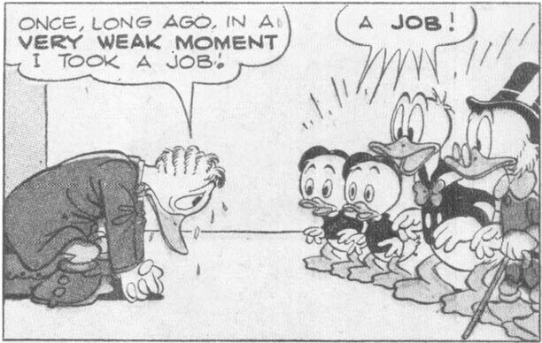
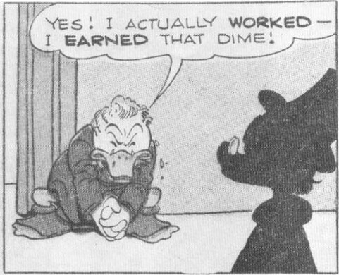
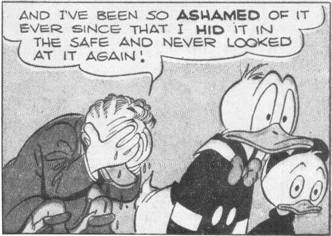
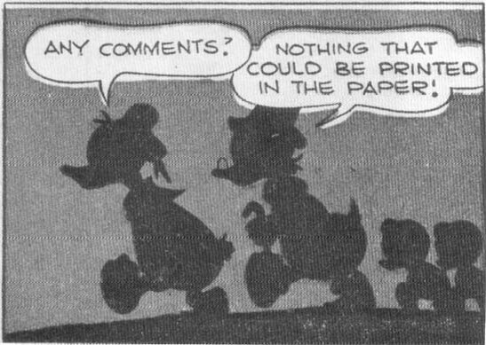

From *Walt Disney's Comics* No. 140, May 1952; © 1952 Walt Disney Productions.

tors seizes him and demands five dollars that Gladstone owes him. Gladstone sticks out his hand and into it floats — not a five, but a ten-dollar bill. Gladstone buys an old trunk for fifty cents at an auction and, sure enough, it contains a hundred dollars in a secret money cache. And so it goes.

Gladstone retained a certain hauteur even when his luck went sour (as it did at times, always temporarily). In the April 1954 *Walt Disney's Comics*, Donald has beaten Gladstone in a raffle drawing in full view of a large audience, and as the ducks and the crowd chortle over his defeat, Gladstone thinks gloomily: "How awful to be a deposed monarch! How terrible to sit in sackcloth and ashes while ragpickers cheer at my downfall."

It was in *Walt Disney's Comics* that the best stories with Gladstone appeared, because it

was in them that his victories over the ducks could be palatable. In a long story like "Luck of the North," the ducks could not be left choking in Gladstone's dust; they had suffered for too many pages for that to be acceptable to young readers, even when their sufferings were self-inflicted.

The unstated message in most of Barks's stories about luck — those with and without Gladstone — was that hard work and honest effort are ends in themselves, and that life's rewards are not reserved for the meritorious. That is a pretty bleak statement for a comic book to make, and a number of Barks's stories about luck were confused and contradictory to some degree, as if he were trying to soften the implications of what was happening to his characters.

This basic difficulty was compounded