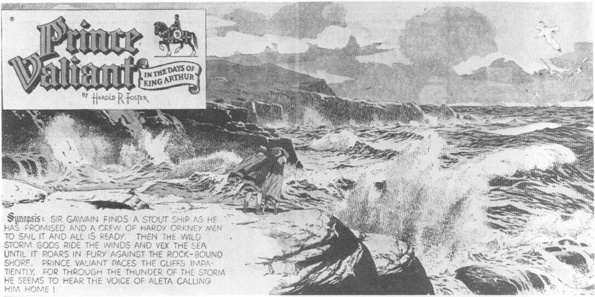
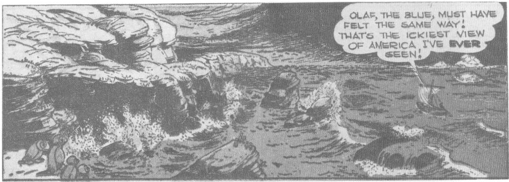

Synopsis: SIR GAWAIN FINDS A STOUT SHIP AS HE HAS PROMISED AND A CREW OF HARDY ORKNEY MEN TO SAIL IT AND ALL IS READY. THEN THE WILD STORM GODS RIDE THE WINDS AND VEX THE SEA UNTIL IT ROARS IN FURY AGAINST THE ROCK-BOUND SHORE. PRINCE VALIANT PACES THE CLIFFS IMPATIENTLY, FOR THROUGH THE THUNDER OF THE STORM HE SEEMS TO HEAR THE VOICE OF ALETA CALLING HIM HOME!

OLAF, THE BLUE, MUST HAVE FELT THE SAME WAY!
THAT'S THE ICKIEST VIEW OF AMERICA I'VE EVER SEEN!

In his "morgue" of reference materials, which included the files shown in a 1969 snapshot, Barks stored the work of such comic-strip masters as Harold Foster and Alex Raymond. He clipped many panels of water scenes from Foster's "Prince Valiant," and their influence can be felt in his depiction of the rugged coast of Labrador in "The Golden Helmet" in *Donald Duck* Four Color No. 408, 1952. In the same story, Barks made the museum where Donald worked as a guard seem just as real as the coast of Labrador—but by introducing fantastic rather than realistic details. "The Golden Helmet" © 1952 Walt Disney Productions; "Prince Valiant" © 1951 King Features Syndicate.