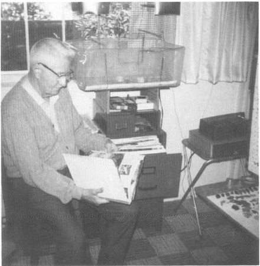
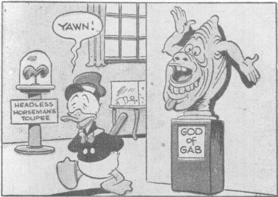
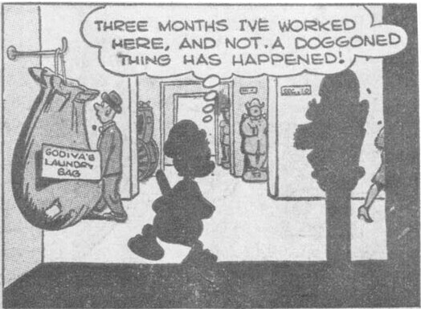
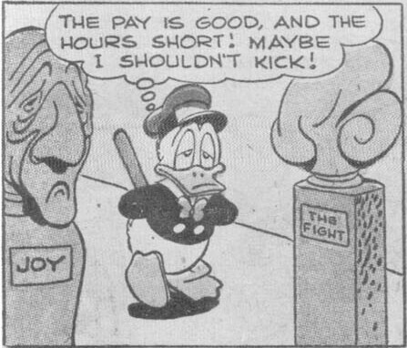
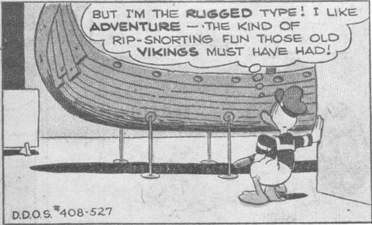

Donald Duck: YAWN!

Donald Duck: THREE MONTHS I'VE WORKED HERE, AND NOT A DOGGONED THING HAS HAPPENED!

Donald Duck: THE PAY IS GOOD, AND THE HOURS SHORT! MAYBE I SHOULDN'T KICK!

Donald Duck: BUT I'M THE RUGGED TYPE! I LIKE ADVENTURE — THE KIND OF RIP-SNORTING FUN THOSE OLD VIKINGS MUST HAVE HAD!

D.D.O.S. #408-527