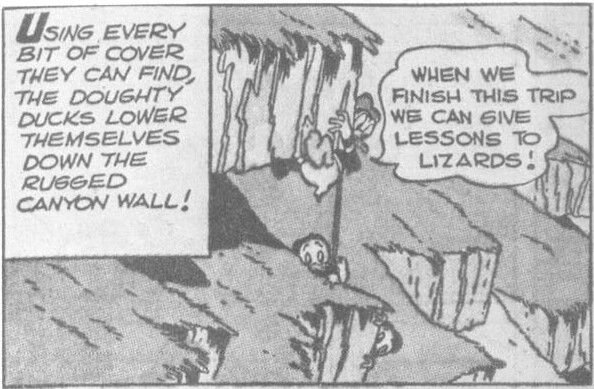
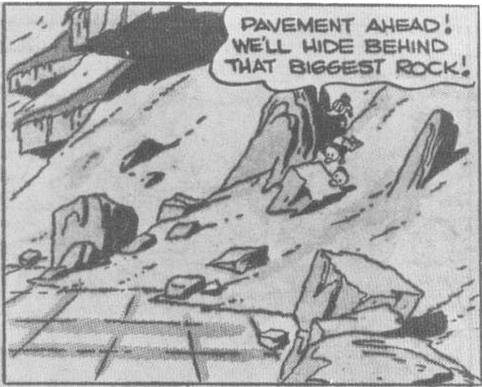
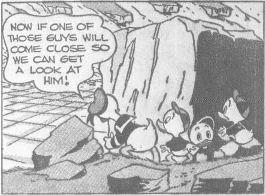
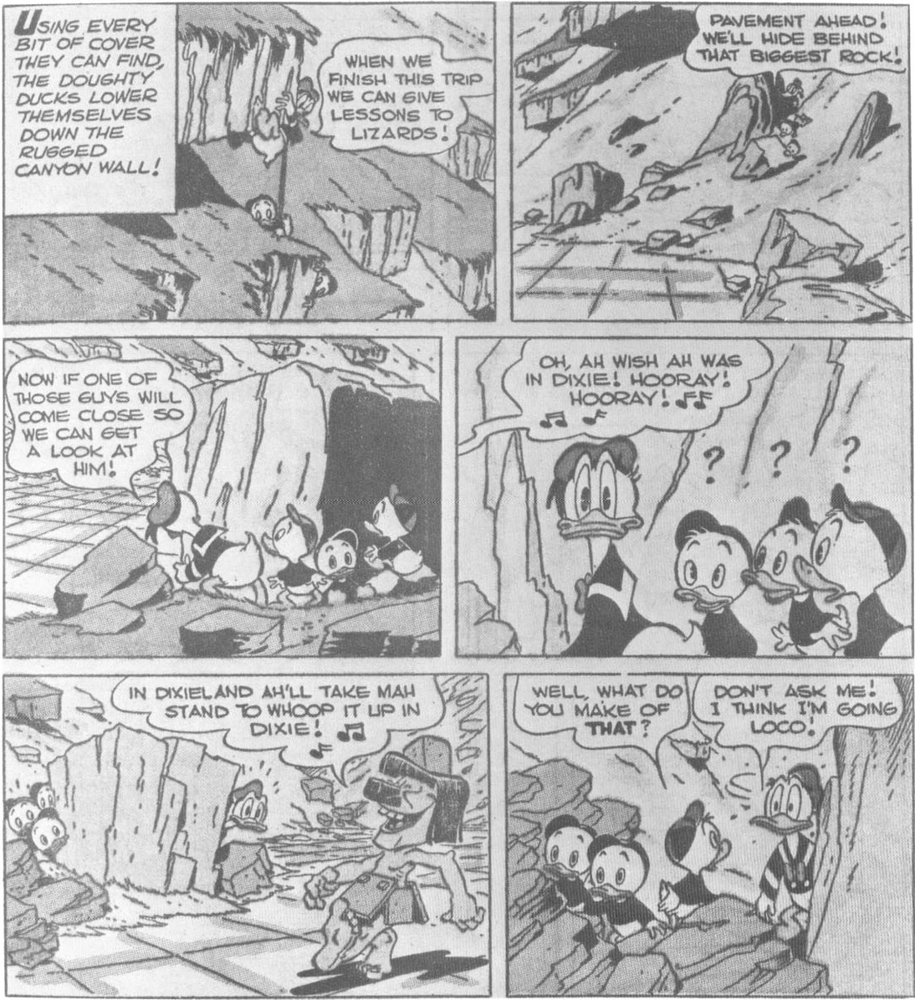
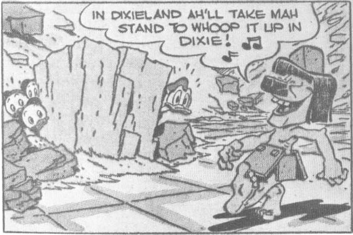
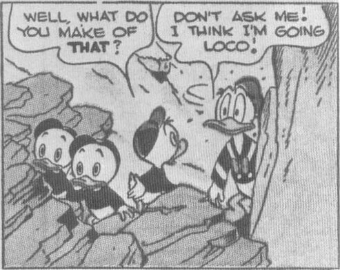

**Narrator**: USING EVERY BIT OF COVER THEY CAN FIND, THE DOUGHTY DUCKS LOWER THEMSELVES DOWN THE RUGGED CANYON WALL!
**Donald**: WHEN WE FINISH THIS TRIP WE CAN GIVE LESSONS TO LIZARDS!

**Donald**: PAVEMENT AHEAD! WE'LL HIDE BEHIND THAT BIGGEST ROCK!

**Donald**: NOW IF ONE OF THOSE GUYS WILL COME CLOSE SO WE CAN GET A LOOK AT HIM!

**Singer (off-panel)**: OH, AH WISH AH WAS IN DIXIE! HOORAY! HOORAY! ♫ ♫
**Nephews**: ? ! ? ?

**Singer**: IN DIXIELAND AH'LL TAKE MAH STAND TO WHOOP IT UP IN DIXIE! ♫

**Nephew**: WELL, WHAT DO YOU MAKE OF THAT?
**Donald**: DON'T ASK ME! I THINK I'M GOING LOCO!

From "Lost in the Andes" in *Donald Duck* Four Color No. 223, 1949; © 1949 Walt Disney Productions