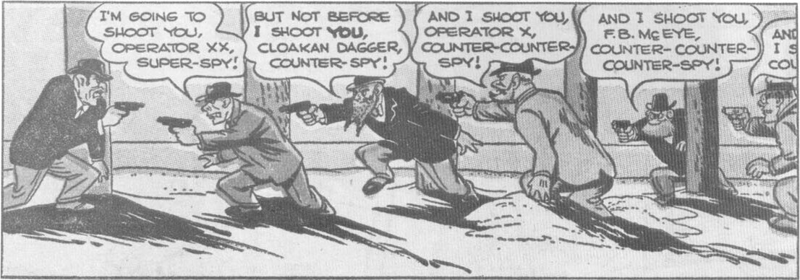

cars and crazy buildings in Duckburg and the strange furnishings of Donald's home looked real enough on their own terms — real enough, that is, for a world in which Donald Duck could exist. As with other artists and writers who are celebrated for the rich detailing of their work, it was Barks's choice of detail that was most striking. He invariably chose the details that made a setting unique. A puffin nesting on the coast of Labrador, a Persian king's ornate robes, the lanky, long-horned cattle that flourished in Old California — it was details like these that gave such a strong feeling of time and place to Barks's stories. His Indian village, his Duckburg street, his Persian palace, and his California ranchero all looked "real" because he chose the right details.

In some stories, the drawing was almost too realistic. The ducks, solid and three-dimensional though they were in Barks's hands, remained cartoon characters who didn't quite fit in wholly realistic settings. Barks has long expressed admiration for such comic-page draftsmen as Alex Raymond and Hal Foster, and their influence — especially Foster's — was most evident in Barks's stories of the early fifties. "The Magic Hourglass" and "Dangerous Disguise" are full of "real" human beings, as opposed to the anthropomorphic dogs who usually pass for homo sapiens in Disney

comic books. The ducks look almost grotesque set beside them, especially in "Dangerous Disguise," which led to Barks being ordered by his editors to give his "humans" their floppy ears and dogs' noses again. Barks's remarkable blend of cartoon characters and realistic settings was disrupted in these stories, as the settings jostled the ducks for center stage.

Another problem was that Barks the illustrator, when he was doing more than providing settings for the ducks, was simply not on a par with Barks the cartoonist. His shortcomings as a natural draftsman, which he had turned to his advantage in earlier stories, were highlighted in some of his stories in the early fifties. The men and women in "Dangerous Disguise" look like emigrants from one of the better adventure comic books of the early forties, which isn't saying much. They come to life only when Barks "cartoons" their faces.

"Dangerous Disguise" is the extreme example, but there were other stories in the early fifties in which the settings were a little too much to the fore. "Vacation Time" (1950, in the first issue of *Vacation Parade*, the second Disney "giant" comic book) is a story dominated by the scenery in a great national park where the ducks are spending their vacation. It is a good story, with some chilling pages when the ducks are almost consumed by a raging forest fire; it lacks only the intensity of "Letter to

From "Dangerous Disguise" in *Donald Duck Four Color* No. 308, 1951; © 1950 Walt Disney Productions.